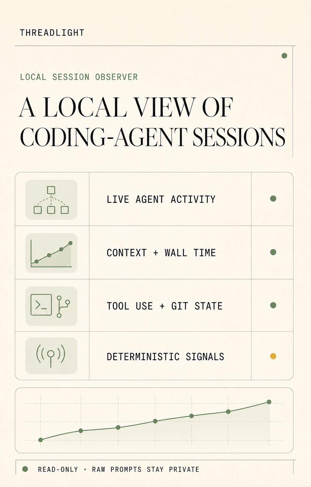

# Threadlight

Threadlight is a lightweight, local-first dashboard for observing live coding-agent sessions. It illuminates agents, context usage, model settings, tool activity, Git changes, usage limits, and deterministic efficiency signals in real time.

The current adapter supports Claude Code. Codex is the next planned integration; the product and normalized data model remain provider-neutral.

<p align="center">
  
</p>

## What it shows

- Session title, project, elapsed wall time, and last activity
- Left-side navigation between concurrent live sessions and recent history, grouped into collapsible projects, with an attention marker when a session needs input
- All-agent current context usage and its latest-snapshot composition
- An opt-in session-machinery total and expandable inventory with provider-estimated category and per-item token counts after running `/context` in the observed Claude Code session
- Parent-child agent hierarchy with descriptions, model IDs, effort levels, status, tool counts, and explicitly invoked skills
- Optional session-, agent-, and execution-task signal tags captured through Threadlight's MCP tools
- The latest provider-generated session summary, when the transcript records one
- Separate primary-agent popovers for live shell executions and Claude's agent-maintained plan checklist
- Current Git branch and every uncommitted path
- Plan limits for the five-hour session, all models, and Fable
- Recent tool activity without displaying prompts or responses
- Deterministic loop and agent-overlap warnings
- Local Markdown retrospective reports for discussion with the main agent

Threadlight does not currently call an AI model. Its analysis and recommendations are rule-based and reproducible.

The **Generate report** button refreshes local session data and downloads a deterministic Markdown summary. Reports include session metrics, per-agent wall time and context snapshots, skill usage, repeated calls, tool distribution, recorded Git metadata, and retrospective questions. Live reports also include plan usage; historical reports do not. Reports never include raw prompts or responses.

Session history is indexed directly from the provider's existing JSONL files; Threadlight does not copy transcripts into a database. Historical views contain recorded session data only, so current plan limits and the current Git working tree are excluded. If the provider removes a transcript, that session also disappears from Threadlight history.

Claude Code's `/context` command writes its rendered context snapshot to the session transcript. Threadlight detects that snapshot automatically, parses its Markdown tables by their column headers, and shows whatever machinery groups the provider reported. Until a session has a recorded snapshot, the dashboard prompts the user to run `/context`; Threadlight never reconstructs the list from the current repository or configuration.

Threadlight combines provider session-registry lifecycle state with transcript activity. A registered interactive session remains live while its process is present, and explicit user-input waits take priority as the live auto-discovery target. Transcript activity in the last five minutes remains the fallback when registry state is unavailable.

## Run locally

Requirements:

- Windows with Node.js 22.13 or newer
- Claude Code with local session persistence enabled
- Git on `PATH`

```powershell
npm ci
npm run dev
```

Open `http://<YOUR-LAN-IP>:3003` from another device on the same network. For
example, if this computer's IPv4 address is `192.168.1.25`, open
`http://192.168.1.25:3003` on your phone.

The development command starts:

- Web dashboard on `0.0.0.0:3003`
- Private monitor API on `127.0.0.1:4317`

The web server proxies `/api/state` to the loopback-only monitor, so private credentials and raw transcripts are never sent to the browser.

## Reported signals through MCP

Threadlight includes a stateless local MCP server with three tools. `report_session_signal` attaches a short label and semantic tone to the overall session header. `report_agent_signal` attaches the same metadata to the calling agent. `report_task_signal` attaches it to a specific execution task by its background task ID or Bash tool-use ID. Threadlight reads the recorded tool calls from agent transcripts and decorates the matching dashboard locations. The transcript is the source of truth for live and historical sessions.

From a Claude Code repository that should use the tool, register this checkout as a local-scoped server. Keep the server name exactly `threadlight`, because the transcript parser uses that namespace:

```powershell
claude mcp add --transport stdio --scope local threadlight -- node "C:\path\to\threadlight\mcp\server.mjs"
```

Local scope makes the server available only to you in that repository and keeps the machine-specific path out of its source tree. Use `--scope user` to make it available in all of your repositories. Project scope writes a shared `.mcp.json`, which is appropriate only when its command can be made portable for everyone using the repository.

Check the connection inside Claude Code with `/mcp`. Custom subagents can reference the configured server in their agent frontmatter and instruct themselves when to report:

```yaml
---
name: code-reviewer
mcpServers:
  - threadlight
---

Review the requested code. Before returning, call `report_agent_signal` once with a concise outcome such as `Approved` or `Rejected` and the corresponding `positive` or `negative` tone. Never include prompts, responses, secrets, commands, or tool output in the label.
```

Supported tones are `neutral`, `info`, `positive`, `warning`, and `negative`. Labels are plain text and limited to 40 characters. The latest `report_session_signal` call across all agents replaces the earlier session tag. Calling `report_agent_signal` again replaces the earlier tag for that agent. Calling `report_task_signal` again with the same `task_id` replaces the earlier task tag. Threadlight derives the reporting agent and report time from the transcript.

For a session-wide milestone or state:

```text
report_session_signal({
  label: "Review round complete",
  tone: "positive"
})
```

For a task-specific outcome, pass the stable background task ID returned by Claude Code, or the corresponding Bash tool-use ID when it is available:

```text
report_task_signal({
  task_id: "review123",
  label: "Approved with suggestions",
  tone: "info"
})
```

Threadlight resolves the supplied ID monitor-side and exposes only the bounded signal on a matching normalized execution task. Unknown or unsafe task identifiers produce no dashboard tag.

## Configuration

The monitor automatically selects a registered session that needs user input first, then an active registered session, then the session tree with the most recent activity under `%USERPROFILE%\.claude\projects`.

| Variable | Purpose | Default |
| --- | --- | --- |
| `CLAUDE_PROJECTS_DIR` | Override the current provider's project/session root | `%USERPROFILE%\.claude\projects` |
| `CLAUDE_SESSION_FILE` | Pin one primary JSONL session | Latest primary session |
| `SESSION_PULSE_PORT` | Change the private monitor API port | `4317` |

Example:

```powershell
$env:CLAUDE_SESSION_FILE='C:\path\to\session.jsonl'
npm run dev
```

## Metrics

Every displayed or reported token number uses the same latest-snapshot concept shown by the provider UI:

- **Agent context:** latest non-zero usage snapshot for that agent
- **All-agent context:** sum of the latest context snapshot for every visible agent

Threadlight does not present cumulative transcript-throughput or token-spend session totals. Its timeline shows positive changes between all-agent context snapshots at consecutive bucket boundaries; repeated snapshots contribute zero and the result is never labeled as token spend. See [docs/METRICS.md](docs/METRICS.md) for formulas and thresholds.

## Privacy and security

- Raw prompt and response text is not returned by the monitor API.
- Session summaries are accepted only from recognized provider summary records, reduced to bounded plain text, and labeled as provider-generated; Threadlight never derives them from raw prompts, responses, or tool results.
- Session-, agent-, and task-signal labels are explicit, bounded metadata from recognized Threadlight MCP calls; supplied task targets, surrounding responses, and tool-result content remain private.
- Agent launch text is used only to derive a concise fallback label.
- Session transcripts and Git state are read-only.
- Git commands use argument arrays rather than shell interpolation.
- OAuth credentials remain in the monitor process.
- Credentials are sent only to the provider's own usage endpoint and never enter browser state.
- Plan usage is refreshed every 60 seconds while a live view is unpaused. Normal session polling and manual refreshes never call the provider usage endpoint; server caching deduplicates simultaneous tabs.

Anyone who can reach port 3003 on the local network can view dashboard metadata. The development server accepts any hostname so it can be reached by IP; bind the web server to localhost if that is inappropriate for your network. Your firewall may prompt you to allow Node.js on private networks.

## Development

```powershell
npm run dev       # web dashboard and monitor
npm run dev:web   # web dashboard only
npm run monitor   # monitor API only
npm run build     # production build
npm test          # build and rendered-output checks
npm run lint      # static linting
```

Important source files:

- `monitor/server.mjs` — discovery, parsing, metrics, Git, and plan usage
- `app/Dashboard.tsx` — live React dashboard
- `app/api/state/route.ts` — same-origin proxy to the private monitor
- `scripts/dev.mjs` — local process orchestration

See [docs/ARCHITECTURE.md](docs/ARCHITECTURE.md) for the data flow and provider-extension plan.

## Current limitations

- The monitor currently supports Claude Code session files only.
- Session duration is elapsed wall time and includes idle periods.
- History is limited to the 49 most recent non-live transcript sessions.
- Subagent completion uses transcript stop reasons, with modification time as a fallback.
- Efficiency warnings are heuristics, not authoritative judgments.
- Transcript parsing reads a bounded tail of each file.

## License

Threadlight is available under the [MIT License](LICENSE).
