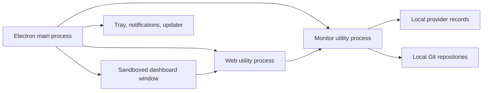

# Pomegr desktop app implementation plan

## Objective

Distribute Pomegr as a one-click Windows desktop application without requiring users to clone the repository, install Node.js, or keep a terminal open. Preserve the existing local-first, read-only architecture, normalized browser API, provider isolation, deterministic metrics, and privacy boundaries.

The first release target is a signed Windows installer that opens Pomegr, discovers existing Claude Code and Codex sessions, runs in the system tray, and can notify the user when a session needs input. Browser-based development remains supported.

This plan is divided into tasks intended to be completed in separate coding sessions. Each task must leave the repository buildable and tested and must not pull later desktop features into its scope.

## How to use this plan

Start a new session with a request such as:

> Implement `POMEGR-DT-03` from `docs/plans/desktop-app-implementation.md`. Preserve unrelated working-tree changes and stop when that task's acceptance criteria are met.

Before starting any task:

1. Read `AGENTS.md`, this plan, and the files named by the task.
2. Run `git status --short` and preserve unrelated changes.
3. Confirm all listed dependencies are complete.
4. Keep raw prompts, responses, commands, patches, stdout, stderr, tool output, credentials, and private transcript content out of the renderer, desktop IPC, notifications, logs, fixtures, and release artifacts.
5. Keep the desktop runtime read-only. Native control actions require a separately approved confirmation design.
6. Update the task checkbox, completion date, implementation notes, and progress log only after its acceptance criteria are met.

## Decision summary

- Use **Electron** for the initial desktop application.
- Keep the current React UI and normalized same-origin HTTP contract.
- Run the monitor and production web server as managed local services owned by Electron.
- Prefer Electron utility processes or another packaged Node runtime mechanism over a system Node.js dependency.
- Bind both desktop services to `127.0.0.1` on dynamically assigned ports.
- Keep renderer sandboxing and context isolation enabled, with Node integration disabled.
- Ship Windows first. macOS and Linux are later projects because provider discovery and lifecycle behavior require platform-specific validation beyond packaging.
- Keep the open-source desktop application under `AGPL-3.0-only`; include the license, notice, source offer, and trademark policy in distributions.
- Retain `npm run dev` as the contributor workflow.

Electron is preferred over Tauri because Pomegr's monitor, provider adapters, Git inspection, and production server are already Node.js modules. Tauri would still require a bundled Node sidecar unless the monitor were rewritten in Rust, adding a second runtime and target-specific sidecar packaging before the product has validated desktop distribution.

## Target architecture



### Process responsibilities

**Electron main process**

- Owns single-instance behavior, application lifecycle, BrowserWindow creation, tray state, notifications, updates, and service supervision.
- Knows runtime ports and any per-launch local authorization value.
- Never parses provider transcripts or exposes unrestricted filesystem or process APIs to the renderer.

**Monitor utility process**

- Reuses the normalized monitor and provider architecture.
- Remains bound to loopback.
- Reads provider records and Git state under the existing privacy allowlists.
- Returns no raw prompts, responses, commands, tool results, credentials, or transcript paths.

**Web utility process**

- Serves the production UI on loopback.
- Proxies same-origin API requests to the private monitor.
- Rejects unexpected hosts and origins.
- Does not receive provider credentials or direct transcript access.

**Renderer**

- Runs sandboxed with `nodeIntegration: false` and `contextIsolation: true`.
- Receives only the existing normalized browser state plus narrowly scoped desktop status where needed.
- Cannot invoke arbitrary shell commands, read files, inspect environment variables, or control agent sessions.

## Desktop security invariants

- Desktop packaging must not weaken any invariant in `AGENTS.md`.
- The renderer must not load remote application code.
- External navigation and new-window creation must be denied by default; allowlisted links open in the user's external browser.
- Preload APIs must be explicit, narrow, immutable, and validated on both sides of IPC.
- Never expose Electron's `ipcRenderer`, filesystem APIs, child-process APIs, environment, or unrestricted URL opening directly to the renderer.
- Use `spawn`/`execFile` argument arrays or Electron utility-process APIs; never construct shell commands from session-derived values.
- Bind desktop services to loopback by default. LAN access is out of scope for the first desktop release.
- Use dynamically allocated ports obtained from the actual listener rather than check-then-bind port probing.
- Add a per-launch local authorization boundary or equivalent origin restriction so another local webpage cannot read Pomegr metadata merely by guessing a port.
- Desktop logs may include bounded lifecycle states, fixed error codes, versions, and timestamps only. They must not contain transcripts, prompts, responses, commands, stdout, stderr, credentials, repository file contents, or provider-local private paths.
- Clean shutdown must stop every child or utility process. Crashes must not leave a monitor or web server running indefinitely.
- Signing credentials, updater credentials, and certificates must exist only in CI secrets or the signing environment and must never enter the repository.

## Product boundaries for the first release

### Included

- Windows x64 installer.
- Optional portable Windows build for testing and recovery.
- One-click application startup.
- Existing Claude Code and Codex observation features.
- System tray and reopen behavior.
- Optional launch at login.
- Privacy-bounded needs-input notifications.
- Signed releases and automatic update checks.
- Existing browser development workflow.

### Excluded

- Agent control, approvals, prompt entry, command execution, or session termination.
- Default LAN exposure.
- Team aggregation or cloud accounts.
- Telemetry or analytics.
- macOS and Linux release artifacts.
- App-store distribution.
- A Rust rewrite or Tauri wrapper.
- Paid entitlement enforcement inside the open-source desktop binary.

## Milestones

- **Runtime feasibility:** `POMEGR-DT-01` through `POMEGR-DT-03`
- **Installable Windows alpha:** `POMEGR-DT-04` and `POMEGR-DT-05`
- **Desktop beta:** `POMEGR-DT-06` through `POMEGR-DT-08`
- **Release readiness:** `POMEGR-DT-09` and `POMEGR-DT-10`

---

## POMEGR-DT-01 — Extract production runtime seams

- [x] Complete
- **Depends on:** none
- **Target size:** 1–2 sessions
- **Completed:** 2026-08-11
- **Implementation notes:** Added loopback-only monitor and production-web lifecycle seams with explicit host/port inputs, operating-system-assigned ports, actual bound-address discovery, idempotent shutdown, bounded lifecycle codes, and thin executable entry points. Production web startup resolves build output relative to its module and accepts an explicit monitor origin; development retains its documented ports and LAN-facing web binding.

### Goal

Make the monitor and production web application startable and stoppable programmatically without changing current CLI behavior.

### Work

- Refactor `monitor/server.mjs` so startup accepts explicit host and port inputs and returns a handle containing the actual bound address and an idempotent async close method.
- Preserve direct `npm run monitor` behavior through a thin executable entry point.
- Add a production web-server entry point that can be started with an explicit loopback host, dynamic port, and monitor origin.
- Remove production-runtime assumptions about repository current working directory.
- Keep development startup in `scripts/dev.mjs` working with its documented ports.
- Prefer listener port `0` for desktop startup so the operating system selects a free port without a race.
- Normalize startup failures into fixed safe error codes; never forward arbitrary exception messages to the renderer.
- Add lifecycle tests covering readiness, dynamic ports, startup failure, repeated close, and unexpected service exit.

### Acceptance criteria

- Tests can start and stop both services in-process or through an injectable process boundary.
- Desktop callers can discover the actual ports after binding.
- `npm run dev`, `npm run monitor`, and production build behavior remain functional.
- The monitor remains bound to loopback.
- No provider transcript schema moves into desktop or React code.

### Verification

```powershell
npm run build
npm run test:node
```

---

## POMEGR-DT-02 — Prove packaged Node runtime compatibility

- [x] Complete
- **Depends on:** `POMEGR-DT-01`
- **Target size:** 1 session
- **Completed:** 2026-08-11
- **Implementation notes:** Added Electron 43.3.0 and a hardened real-ASAR smoke fixture using Electron's bundled Node runtime. The accepted feasibility fallback runs the provider-owning monitor in one self-contained physical worker and the provider-neutral web lifecycle in Electron main. Main/web use a strict keep-only environment and a `PATH` with every system-Node directory removed while preserving Git; provider/home paths reach only the monitor through a temporary allowlisted snapshot. The accepted unpack boundary is the monitor bundle, the complete generated `dist/` tree required by Vinext's physical `outDir`, and the three Sharp Windows native files. The final post-hardening `npm.cmd run desktop:smoke` passed manually in normal PowerShell with bounded cleanup.

### Goal

Verify that Pomegr's production monitor and web server can run under Electron's packaged Node environment without requiring system Node.js.

### Work

- Add Electron as a development dependency and create a minimal main-process entry point under `desktop/`.
- Evaluate Electron utility processes as the preferred service host.
- Prove ESM loading, native dependency behavior, fetch, filesystem access, Git execution, loopback listeners, graceful shutdown, and provider discovery from a packaged-style resource path.
- Record any files that must be unpacked from ASAR and why.
- Do not build the full desktop UI, tray, updater, or installer in this task.
- Add a focused compatibility test or smoke script that fails if system `node` is required.
- Document the accepted runtime structure in `docs/ARCHITECTURE.md`.

### Acceptance criteria

- A minimal Electron process starts the monitor and web runtime using Electron's bundled runtime.
- Pomegr opens no external terminal window.
- The experiment leaves no background processes after exit.
- The accepted ASAR/unpacked-resource boundary is documented and minimal.
- No provider data or credentials are copied into application resources.

### Verification

```powershell
npm run build
npm run test:node
npm run desktop:smoke
```

---

## POMEGR-DT-03 — Build the secure Electron shell and service supervisor

- [x] Complete
- **Depends on:** `POMEGR-DT-02`
- **Target size:** 1–2 sessions
- **Completed:** 2026-08-11
- **Implementation notes:** Added the single-instance Electron shell, sandboxed dashboard window, fixed external-link allowlist, restrictive CSP, denied permissions/downloads/webviews/navigation/window creation, dynamic loopback services, and an ephemeral launch-token boundary with strict Host/Origin/read-only-method checks. Startup and shutdown use bounded injectable orchestration with fixed safe errors and supervised cleanup. The preload was initially empty and POMEGR-DT-04 later added only a validated report-save method. The accepted POMEGR-DT-02 fallback remains one credential-owning monitor worker plus the provider-neutral web lifecycle in Electron main; a monitor-worker Git probe and the upgraded hidden-`BrowserWindow` packaged smoke passed in normal PowerShell.

### Goal

Open the production Pomegr dashboard in a secure desktop window and supervise its local services for the full application lifecycle.

### Work

- Create the Electron main entry point, minimal preload, and desktop-specific build configuration.
- Enforce a single application instance; a second launch focuses the existing window.
- Start the monitor first, pass its origin to the web runtime, then load the web origin only after both report ready.
- Use dynamic loopback ports and an ephemeral per-launch authorization boundary or equivalent strict local-origin mechanism.
- Configure BrowserWindow with renderer sandboxing, context isolation, Node integration disabled, a restrictive Content Security Policy, and no remote module assumptions.
- Deny unexpected navigation, downloads, permissions, webviews, and window creation.
- Open only explicitly allowlisted documentation/source links in the external browser.
- Show a bounded local startup-error screen when services fail; do not display raw exception text.
- Supervise unexpected utility-process exits and shut down the remaining runtime cleanly.
- Keep desktop lifecycle state out of the normalized monitor API unless the UI genuinely needs a new bounded contract field.

### Acceptance criteria

- Launching Electron opens the Pomegr dashboard without a separate browser or terminal.
- A second launch focuses the first instance.
- The renderer has no Node.js or unrestricted Electron access.
- Unexpected local origins and external navigation are blocked.
- Closing the application stops all owned services.
- Startup failures reveal no private paths or arbitrary exception content.

### Verification

```powershell
npm run build
npm test
npm run desktop:smoke
npm run lint
```

- Inspect BrowserWindow preferences in a focused automated test.
- Confirm no service port accepts non-loopback connections.

---

## POMEGR-DT-04 — Make installed-path discovery reliable

- [x] Complete
- **Depends on:** `POMEGR-DT-03`
- **Target size:** 1 session
- **Completed:** 2026-08-11
- **Implementation notes:** Added cwd-independent installed/portable resource and user-data resolution, early portable Electron data redirection, stable allowlisted Pomegr settings/snapshot roots, preserved provider-owned Claude/Codex discovery and Git paths, and a trusted bounded native report-save flow. Desktop settings persist only the versioned window/login/notification/update schema; missing files may be created, while malformed, unreadable, or newer-version files cannot be overwritten on close and explicit recovery quarantines the original. Windows space/non-ASCII/different-cwd coverage, full tests/lint, and the final normal-PowerShell packaged smoke passed.

### Goal

Make provider discovery, Git inspection, configuration, reports, and Pomegr-owned state work from an installed or portable application path.

### Work

- Audit uses of `process.cwd()`, source-relative paths, executable paths, and development-only directories.
- Resolve packaged resources through Electron's application/resource paths rather than the launch directory.
- Resolve user-owned Pomegr data through a stable application-data directory while preserving documented override variables where appropriate.
- Keep provider transcripts in their provider-owned locations; never copy them into Pomegr storage.
- Ensure cost snapshots, Codex liveness snapshots, caches, and desktop settings retain their current privacy allowlists.
- Define a bounded desktop settings schema for window state, launch-at-login preference, notification preference, and update preference.
- Do not store OAuth tokens or provider credentials in desktop settings.
- Test Windows paths containing spaces, non-ASCII characters, and a different working directory.

### Acceptance criteria

- Installed startup does not depend on the repository path or current working directory.
- Claude Code and Codex default and override discovery still work.
- Reports save through an explicit user action or documented local destination.
- Desktop settings contain no credentials, transcript paths, prompts, responses, or tool content.
- Portable and installed modes do not overwrite provider-owned data.

### Verification

```powershell
npm run build
npm test
npm run desktop:smoke
```

---

## POMEGR-DT-05 — Produce the Windows installer and portable build

- [x] Complete
- **Depends on:** `POMEGR-DT-04`
- **Target size:** 1–2 sessions
- **Completed:** 2026-08-11
- **Implementation notes:** Added an explicit electron-builder allowlist, per-user NSIS installer, portable build, packaged legal/source/dependency notices, artifact inspection, and a test-only 0.0.9 upgrade fixture. Installed startup no longer requires Git, generated Vinext entries can install bounded console-warning filters, and a Windows-safe static fallback serves authorized CSS/JavaScript with the desktop no-store and security headers. The strengthened packaged smoke verifies CSS application, React hydration, normalized state/catalog delivery, and renderer isolation. A clean Windows Sandbox without system Node.js or Git passed install, first launch, 0.0.9-to-0.1.0 in-place upgrade, portable launch and storage, clean shutdown, and uninstall/data-preservation checks. Accepted SHA-256 values: prior `F3C70717DB2CA3A586176EA216A2A747B3D04CBB4713CAF700DB43E55A3CC1FF`, setup `CE79013A31EE2461748665F4DA9776A8F260EBF4E19B4C5A9D474036A4BD9597`, portable `39DB7D6D011A4EC273EB8F93588A61CFE32D69845E3521EE1746053FB8B971FA`.

### Goal

Produce installable Windows artifacts that include everything required to run Pomegr without Node.js or a repository checkout.

### Work

- Configure `electron-builder` as the packaging tool.
- Produce an NSIS per-user installer and a portable artifact for beta testing.
- Define the application ID, executable name, publisher metadata, icons, shortcuts, uninstall behavior, and artifact naming without provider-specific branding.
- Include `LICENSE`, `NOTICE`, `TRADEMARKS.md`, the AGPL source offer, and dependency notices in the packaged application.
- Ensure application resources contain no transcripts, credentials, `.env` files, test fixtures with unsafe data, build caches, Wrangler state, or local configuration.
- Add a packaging allowlist instead of relying on a broad repository include.
- Add an artifact-inspection test that enumerates packaged files and fails on forbidden patterns.
- Verify install, first launch, upgrade-in-place, uninstall, and portable launch on a clean Windows VM.

### Acceptance criteria

- A clean Windows machine can install and open Pomegr without Node.js.
- The installer does not require administrator privileges for normal per-user installation.
- Uninstall removes application files but does not delete provider data or unrelated user data.
- The packaged legal/source notices are accessible from the About page.
- Packaged artifacts contain no private or development-only files.

### Verification

```powershell
npm run desktop:package
npm run desktop:inspect
npm test
```

- Perform a clean-VM install/uninstall checklist and record only versions, paths owned by Pomegr, and pass/fail results.

---

## POMEGR-DT-06 — Add tray, window, and launch-at-login behavior

- [x] Complete
- **Depends on:** `POMEGR-DT-05`
- **Target size:** 1 session
- **Completed:** 2026-08-11
- **Implementation notes:** Added a bounded system tray and accessible in-app controls for open, UI-refresh pause/resume, About, launch at login, close behavior, and explicit quit. Close-to-tray is explained on first use and safely remembered; explicit quit, OS shutdown, and second-instance activation have deterministic cleanup/focus behavior. Launch at login remains opt-in, settings mutations serialize without resurrecting rejected values, and window bounds restore and re-clamp on live display changes. Pause affects only renderer polling, never provider state. A trusted allowlisted theme bridge synchronizes the standard Windows title bar with light/dark mode. Full build, Node/UI tests, lint, packaging inspection, the normal-PowerShell packaged smoke, and installed dark/light title-bar and native-control checks passed.

### Goal

Let Pomegr remain available in the background without surprising the user or leaving ambiguous process state.

### Work

- Add a system tray icon with actions to open Pomegr, pause live refresh, open About, and quit.
- Make window-close behavior explicit: minimize to tray only after informing the user, with a setting to change the behavior.
- Add optional launch at login, disabled by default for the first release.
- Restore bounded window size and position while ensuring the window remains visible after display changes.
- Keep “Quit Pomegr” as an explicit action that stops all services.
- Ensure pause affects UI polling only and does not mutate provider state.
- Add keyboard and screen-reader accessible equivalents for tray-only actions where applicable.

### Acceptance criteria

- Closing, reopening, quitting, and second-instance launch have deterministic tested behavior.
- No orphaned monitor or web process remains after explicit quit or OS shutdown.
- Launch at login is opt-in and reversible.
- Window-state settings contain no session or provider-private data.

### Verification

```powershell
npm run desktop:smoke
npm run test:ui
npm run lint
```

---

## POMEGR-DT-07 — Add privacy-bounded native notifications

- [x] Complete
- **Depends on:** `POMEGR-DT-06`
- **Target size:** 1 session
- **Completed:** 2026-08-12
- **Implementation notes:** Added native needs-input notifications derived only from the normalized session catalog, with transition deduplication, deterministic clearing, fixed privacy-bounded payloads, safe click-through session selection, a persistent notification preference, and temporary one-hour quiet mode. Focused Node/UI coverage, the production build, lint, and packaged desktop smoke pass.

### Goal

Notify the user when an observed session newly needs input without exposing private conversation or command content.

### Work

- Derive notifications only from normalized needs-input state already safe for the browser.
- Use bounded copy such as “A coding-agent session needs input” plus the existing safe session title when available.
- Never include the question, choices, prompt, command, tool input, repository file content, stdout, stderr, or approval details.
- Deduplicate by normalized session ID and state transition so polling does not repeat notifications.
- Clear notification eligibility when the request resolves, the session stops being live, or notifications are disabled.
- Clicking a notification focuses Pomegr and selects the matching safe session ID; it must not answer or control the session.
- Add per-app notification preference and a temporary quiet mode.

### Acceptance criteria

- One new needs-input transition produces at most one notification.
- Repeated snapshots produce no notification.
- Resolved and expired heuristic states clear deterministically.
- Notification payload tests contain privacy sentinels and prove none are rendered.
- Clicking a notification performs observation/navigation only.

### Verification

```powershell
npm test
npm run desktop:smoke
```

---

## POMEGR-DT-08 — Add signed releases and automatic updates

- [ ] Complete
- **Depends on:** `POMEGR-DT-05`, `POMEGR-DT-06`
- **Target size:** 1–2 sessions
- **Acceptance status:** Repository implementation and automated release gates are in place. Completion remains blocked on external evidence from two real signed beta releases: clean-Windows-VM upgrade, invalid-signer rejection, checksum/signature re-verification, and CI log inspection. See `docs/DESKTOP_RELEASES.md`.

### Goal

Publish verifiable Windows releases and update installed copies safely through GitHub Releases.

### Work

- Add a release workflow that builds from a clean tagged commit.
- Configure Windows code signing through CI secrets; fail release builds when signing is unavailable or invalid.
- Configure `electron-updater` for signed NSIS artifacts and GitHub Releases.
- Check for updates after startup without blocking the dashboard; require explicit confirmation before restart/install during beta.
- Verify downloaded update signatures and expected publisher identity.
- Publish checksums, release notes, AGPL source archives, license notices, and installer artifacts together.
- Keep prerelease and stable channels separate.
- Add rollback guidance: publish a higher fixed version rather than reusing a broken version number.
- Never log update credentials, signed URLs containing secrets, or certificate material.

### Acceptance criteria

- A signed older beta can discover, download, verify, and install a newer beta.
- Unsigned or incorrectly signed updates are rejected.
- Update failure leaves the current installation usable.
- Every binary release has matching corresponding source available at no charge.
- Signing credentials never appear in repository history or artifacts.

### Verification

- Exercise an update from one test version to the next on a clean Windows VM.
- Verify signature and checksum before and after installation.
- Inspect workflow logs for secret masking and private-path leakage.

---

## POMEGR-DT-09 — Complete desktop privacy and security QA

- [ ] Complete
- **Depends on:** `POMEGR-DT-03` through `POMEGR-DT-08`
- **Target size:** 1–2 sessions

### Goal

Prove that desktop packaging and native integrations do not weaken Pomegr's security, privacy, read-only behavior, or failure isolation.

### Work

- Add automated assertions for BrowserWindow sandboxing, context isolation, disabled Node integration, denied webviews, denied unexpected navigation, and bounded preload APIs.
- Test local-origin authorization, Host/Origin rejection, dynamic ports, concurrent local clients, and launch-lifetime authorization revocation.
- Repeat `/api/state` and `/api/sessions` serialization privacy audits through the packaged desktop path.
- Add desktop IPC privacy sentinels for prompts, responses, commands, tool output, credentials, environment values, private paths, and arbitrary exceptions.
- Verify notifications, tray labels, desktop logs, crash handling, and update errors contain only bounded safe metadata.
- Verify the monitor remains read-only under desktop startup and cannot perform provider control actions.
- Test process cleanup after normal quit, renderer crash, utility-process crash, update restart, Windows logoff, and forced application termination.
- Audit packaged dependencies and record their licenses without changing third-party terms.

### Acceptance criteria

- No forbidden privacy sentinel reaches the renderer, IPC payloads, notifications, logs, crash UI, or release artifacts.
- The renderer cannot access filesystem, shell, process, unrestricted IPC, or Electron internals.
- Unexpected local origins cannot read desktop metadata.
- Provider, Git, web, tray, notification, and updater failures degrade independently.
- All observed desktop behavior remains read-only.

### Verification

```powershell
npm run build
npm test
npm run desktop:smoke
npm run desktop:security
npm run desktop:inspect
npm run lint
```

---

## POMEGR-DT-10 — Run beta acceptance and publish desktop documentation

- [ ] Complete
- **Depends on:** all previous tasks
- **Target size:** 1 session
- **Acceptance status:** Automation, user/contributor documentation, and the release checklist are implemented. Final signed-beta clean-VM evidence remains open; the earlier unsigned alpha VM record cannot satisfy it.

### Goal

Validate the complete first-run experience and document the supported desktop behavior before calling the Windows application production-ready.

### Work

- Test the complete path on a clean supported Windows VM:
  1. download the installer;
  2. verify publisher/signature;
  3. install without Node.js;
  4. launch without a terminal;
  5. discover existing supported provider sessions;
  6. receive and clear a synthetic safe needs-input notification;
  7. restart and preserve bounded preferences;
  8. update to a newer signed version;
  9. uninstall without touching provider data.
- Update `README.md` with desktop installation as the primary user path and source development as a separate path.
- Update `docs/ARCHITECTURE.md` with desktop process ownership and security boundaries.
- Update `docs/CONFIGURATION.md` with desktop paths, settings, startup, notifications, updates, portable mode, and troubleshooting.
- Document that LAN sharing is unavailable or explicitly opt-in, depending on shipped behavior.
- Document Windows-only support without implying macOS/Linux compatibility.
- Add a release checklist covering source availability, AGPL notices, trademark policy, signatures, checksums, artifacts, and clean-VM results.
- Remove temporary diagnostics, unsigned test artifacts, and local signing configuration.

### Acceptance criteria

- A new user can go from download to visible sessions without cloning the repository or installing Node.js.
- User documentation distinguishes desktop installation, portable beta, and contributor development.
- No unsupported operating system or provider capability is implied.
- The release has corresponding source, legal notices, signatures, checksums, and reproducible version metadata.
- Full build, test, lint, desktop security, and artifact-inspection checks pass.

### Verification

```powershell
npm run build
npm test
npm run desktop:smoke
npm run desktop:security
npm run desktop:inspect
npm run lint
```

## Definition of done

The first Pomegr desktop release is complete when:

- A signed Windows installer runs on a clean supported machine without system Node.js.
- Pomegr opens in a secure Electron window and discovers supported local sessions.
- The monitor and web services bind only to loopback and stop with the application.
- The renderer, IPC, notifications, logs, and artifacts contain no forbidden private content.
- Tray, reopen, explicit quit, optional login startup, and needs-input notifications behave deterministically.
- Signed updates work without weakening source availability or update integrity.
- The existing browser development workflow remains functional.
- The packaged application includes AGPL, source, copyright, warranty, and trademark notices.
- Documentation accurately describes Windows support, privacy boundaries, local storage, and troubleshooting.
- `npm run build`, `npm test`, `npm run lint`, and all desktop-specific QA commands pass.

## Progress log

Add short entries only after completing a task.

| Date | Task | Result | Notes |
|---|---|---|---|
| 2026-08-11 | POMEGR-DT-01 | Complete | Added programmatic monitor/web startup and shutdown, dynamic loopback ports, safe lifecycle failures, cwd-independent production startup, and lifecycle regression coverage. `npm test` and `npm run lint` pass. |
| 2026-08-11 | POMEGR-DT-02 | Complete | Final normal-PowerShell packaged smoke passed with strict main/web environment isolation, system-Node-free PATH with Git retained, one monitor worker, physical Vinext output, Sharp native loading, dynamic loopback ports, and bounded cleanup. |
| 2026-08-11 | POMEGR-DT-03 | Complete | Added the secure single-instance shell, launch-token and local-origin gates, sandboxed renderer with no native API, bounded service supervision and failure UI, strict navigation/permission/download denial, and focused lifecycle/security coverage. The upgraded normal-PowerShell packaged dashboard smoke passed. |
| 2026-08-11 | POMEGR-DT-04 | Complete | Added installed/portable path resolution, isolated Pomegr-owned storage, preserved provider roots, bounded settings with safe read-failure/quarantine recovery, explicit validated report saving, Windows path coverage, and a passing normal-PowerShell packaged smoke. |
| 2026-08-11 | POMEGR-DT-05 | Complete | Produced and inspected the per-user installer, portable build, and test-only upgrade fixture; fixed Git-independent startup and Windows static delivery; all clean-Sandbox install, upgrade, portable, shutdown, uninstall, and data-boundary checks passed with the recorded artifact hashes. |
| 2026-08-11 | POMEGR-DT-06 | Complete | Added deterministic tray/window/quit/second-instance behavior, opt-in launch at login, UI-only pause controls, serialized bounded settings, live display re-clamping, and trusted native title-bar theme sync. Packaged smoke and installed dark/light native-chrome checks passed. |
| 2026-08-12 | POMEGR-DT-07 | Complete | Added privacy-bounded needs-input transition notifications, deterministic deduplication/clearing, safe observation-only click navigation, persistent enablement, temporary quiet mode, and sentinel coverage. Build, lint, focused tests, and packaged smoke pass. |

## Reference documentation

- [Electron process model](https://www.electronjs.org/docs/latest/tutorial/process-model)
- [Electron security recommendations](https://www.electronjs.org/docs/latest/tutorial/security)
- [Electron process sandboxing](https://www.electronjs.org/docs/latest/tutorial/sandbox)
- [Electron inter-process communication](https://www.electronjs.org/docs/latest/tutorial/ipc)
- [electron-builder documentation](https://www.electron.build/)
- [electron-builder automatic updates](https://www.electron.build/docs/features/auto-update/)
- [electron-builder Windows signing](https://www.electron.build/docs/features/code-signing/code-signing-win/)
