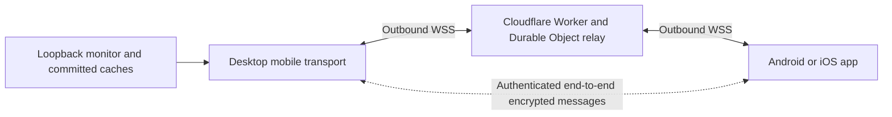

# Pomegr Android and iOS pairing through Cloudflare

> Proposed high-level plan, recorded September 7, 2026. No mobile transport,
> infrastructure, or security-policy change is implemented by this document.
> Runtime authority remains [AGENTS.md](../../AGENTS.md) and
> [OBSERVATION_CACHE.md](../OBSERVATION_CACHE.md).

## Objective

Let a user scan a QR code on Pomegr Desktop with the Pomegr Android or iOS app,
approve that phone, and view normalized session observations from another network.
Pairing survives temporary outages, address changes, and desktop restarts. The user
does not configure certificates, a VPN, tunnels, or router port forwarding.

Use the existing Pomegr domains and Cloudflare account, targeting the Workers Paid
included allowances and an initial operating budget of US$25/month. This is a
budget target, not a service limit or guaranteed bill. Apple Developer and Google
Play accounts already exist and require no new enrollment purchase for this work.

## Relationship to the broader product plan

This is a focused companion to [remote-platform-and-orgs.md](remote-platform-and-orgs.md).
It details personal device pairing, an encrypted relay, and operating costs. It does
not implement organizations, account billing, fleet history, or cross-machine
provider polling coordination.

The first product milestone uses the relay, consistent with the broader plan's
remote-access direction. Direct local HTTPS is an optional later optimization,
not a prerequisite. Adding it would explicitly revise that plan's backend-only
mobile-client assumption. Whether personal accounts are required at launch remains
an explicit decision: device authentication is mandatory even without user accounts.

## Architecture

- The monitor remains private and bound to loopback. A desktop-owned transport
  serves only approved, bounded, normalized reads from committed response caches.
- Both desktop and phone initiate outbound connections to Cloudflare. The relay
  routes messages between authorized devices without requiring inbound router rules.
- Public HTTPS/WSS authenticates the Cloudflare endpoint. A separate, reviewed
  end-to-end protocol authenticates the devices and protects application payloads
  from the relay. Ordinary proxy HTTPS alone does not provide this property.
- Each device generates and protects its own private identity key. The cloud cannot
  substitute a newly registered key for a desktop identity already trusted by a phone.
- Package the mobile UI with the app and use a native networking layer. Do not assume
  that wrapping the current dashboard in a WebView supplies pairing or encryption.
- The desktop must be running and reachable for fresh observations. Previously
  received data may be displayed with its original age; offline is not fresh state.

## Pairing and connection lifecycle

1. **Begin on desktop.** The user selects Pair phone. The desktop creates a
   short-lived, single-use invitation and displays a QR code.
2. **Scan in the app.** The invitation carries a bounded protocol version, opaque
   invitation identifier, desktop identity fingerprint, and strong one-time secret.
   It contains no provider information, transcript paths, or permanent credentials.
3. **Authenticate the exchange.** The phone proves possession of the invitation and
   the desktop proves its identity using an established authenticated protocol.
   Bind the invitation to the phone key being approved; consume it atomically.
4. **Approve on desktop.** Show the proposed phone and require native confirmation.
   A descriptive phone name is presentation metadata, not authentication evidence.
5. **Remember the relationship.** Store approved device identities and narrowly scoped
   read permissions locally. Protect keys through Windows native secure storage,
   Apple Keychain, and Android Keystore as supported by the selected implementation.
6. **Reconnect automatically.** Reauthenticate with fresh session keys after transport
   loss. Use bounded backoff, jitter, and cancellation. A failed network probe, Public
   network label, or changed IP alone does not revoke this new paired relationship.
7. **Manage access explicitly.** List paired phones and support Unpair. Stop sharing
   immediately closes active access while preserving pairing unless the user unpairs.
   Identity reset or an unrecognized key change requires a new trusted pairing.

Invitation expiry and paired-device lifetime are different concepts. Renew transport
credentials without silently replacing the approved device identity. Define replay
protection, protocol-version negotiation, key rotation, and device-loss recovery before
implementation; this sequence is not a cryptographic protocol specification.

Use a proposed `pair.pomegr.com` HTTPS link for Apple Universal Links and Android App
Links, with a static installation fallback. Keep invitation secrets out of URL paths,
queries, analytics, referrers, and server logs; define and test fragment handling in
the native apps. A user who installs after scanning can scan again. The fallback
page should have no third-party scripts that could inspect pairing material.

## Cloudflare infrastructure

| Component | Responsibility | Provisioning approach |
| --- | --- | --- |
| Existing DNS zone | Proposed `pair.pomegr.com` and `connect.pomegr.com` | Reuse the existing domain; no per-desktop public domain required for the relay. |
| Static pairing page | App association files and installation guidance | Serve static assets over managed HTTPS, independently of session data. |
| Workers Paid service | Device enrollment/authentication, invitation coordination, connection admission, quotas | Separate production deployment and secrets from the landing Worker. |
| Durable Objects | Coordinate authorized socket pairs and enforce invitation consumption/revocation | Both devices connect inbound to the object; use WebSocket Hibernation. |
| Durable Objects SQLite | Minimal durable device authorization and invitation state | Store opaque identifiers, public keys/verifiers, expiry and revocation metadata; enforce retention. |
| Operational telemetry | Aggregate failures, connections, queue pressure, processing duration, and spending | Sample bounded diagnostics; exclude payloads, tokens, private keys, and sensitive identifiers. |
| Staging environment | Isolated protocol and mobile integration testing | Separate bindings, device identities, secrets, and deployment rollback. |

Cloud relay admission must use authenticated enrollment and short-lived, scoped
permissions. An invitation or connection identifier alone is not authorization.
Rate-limit enrollment and invitations, bound connections and message sizes, and
prevent an unauthenticated public relay. Budget alerts do not impose a hard cap:
define application quotas and an operator-controlled relay disable switch.

No D1 account database, cloud history store, TURN service, or notification service is
required for the initial pairing milestone. Add D1 if account features need it. Add
APNs/FCM when notifications are implemented; do not rely on an indefinitely running
mobile background WebSocket.

## Privacy and compatibility boundaries

- Forward only the mobile read allowlist. Never expose the unrestricted desktop
  service or monitor, arbitrary proxy targets, native IPC actions, or transcript paths.
- Raw prompts, responses, commands, tool results, provider credentials, and source
  records remain private. Encryption does not make prohibited exports acceptable.
- Device private keys and session decryption keys stay on the devices. Cloudflare
  can still observe routing metadata, IP addresses, timing, and traffic volume.
- Do not persist relayed session payloads, including ciphertext, for this milestone.
  Use bounded live queues and discard them on disconnect. Reconnect from committed
  revisions rather than building a second observation history in the relay.
- Preserve readiness, revisions, and original observation times across transport
  reconnection. Mobile reads must not synchronously acquire or parse provider data.
- Introduce device-pairing storage as a separate native-owned contract; it must not
  enter observation checkpoints or normalized session state. Current phone sharing
  persists only its startup preference, so this is an explicit contract extension.
- Keep the existing HTTP browser gateway's network restrictions until an independently
  reviewed migration replaces it. Do not remove those protections merely because the
  new mobile relay supports trusted identities over encrypted connections.
- Before shipping, update the canonical observation/desktop security documentation,
  shared mobile contracts, and applicable serialization checks together.

## Cost plan

Pricing references were checked September 7, 2026. Values are USD before tax and
must be rechecked before provisioning. Included allowances are shared with other
workloads on the same account; the current account plan and remaining allowances
have not been inspected.

| Item | Published baseline / planning assumption |
| --- | --- |
| Cloudflare DNS and public endpoint certificates | No additional service charge on the applicable free offerings; existing domain renewals continue. |
| Workers Paid | US$5/month account minimum; not a separate US$5 charge per Worker. |
| Durable Objects compute | Includes 1 million requests and 400,000 GB-seconds/month; excess is US$0.15/million requests and US$12.50/million GB-seconds, subject to billing-unit rounding. |
| Relay message billing | Incoming WebSocket messages use a 20:1 request-billing ratio; outgoing messages are not charged as requests. |
| Durable Objects SQLite | Included storage/read/write allowances should cover small pairing records initially; usage beyond allowances is metered. |
| Initial operating allowance | US$25/month target, excluding development, security review, CI/build hardware, domain renewals, and existing store memberships. |

Hibernate between events and avoid periodic work or outbound sockets inside objects
that would keep them active. Do not write every relayed message to storage or logs.
Measure actual encrypted payload sizes, frame counts, handshake/reconnect work,
active duration, and idle behavior before estimating per-user cost. Earlier small
message estimates are illustrative and do not establish production capacity.

## Delivery phases and exit criteria

| Phase | Deliverable | Exit criteria |
| --- | --- | --- |
| 1. Protocol and platform proof | Select the mobile stack, reviewed encryption implementation, identity storage, and versioned read protocol. Decide whether launch requires accounts. | Real Android and iOS devices authenticate a test desktop; wrong keys and replayed/expired invitations fail; key renewal and recovery are demonstrated. |
| 2. Cloudflare staging | Separate Worker/DO deployment, app association files, admission controls, quotas, sampled telemetry, and rollback. | Both platforms and desktop connect; no public unauthenticated relay; secrets and payloads are absent from logs; idle hibernation is measured. |
| 3. Product pairing | Native desktop QR/approval/device management and mobile scan flow; persistent paired identities. | Pair, restart, reconnect, Stop, and Unpair work on both platforms; concurrent invitation consumption allows only the approved phone. |
| 4. Read-only remote viewing | Route approved reads and revision notifications through the encrypted relay. | Local and remote projections agree; Wi-Fi/cellular transitions recover without re-pairing; stale results cannot override newer revisions or revocation. |
| 5. Bounded beta | Run representative concurrent pairs, idle desktops, and real session payloads. | Measure monthly cost, payload bounds, slow-client handling, outage recovery, and quota enforcement; verify privacy and define release limits from results. |
| Later | Optional direct local HTTPS, notifications, accounts, and organizations. | Each extension has an explicit trust/storage/authorization contract and its own acceptance criteria. |

Protocol testing must include tampering, wrong-device routing, replay, expiry,
revocation during in-flight work, delayed callbacks after Stop, relay restart,
mobile suspension, desktop sleep, blocked networks, and incompatible app versions.
Use meaningful integration tests and real-device checks in addition to unit tests.

## Repository ownership and next step

- Start desktop changes from `desktop/lan-sharing.mjs`, `desktop/lan-gateway.mjs`,
  and the desktop lifecycle owner; keep provider acquisition out of the transport.
- Define bounded shared mobile contracts separately from private provider schemas.
- Follow [AGENT-WORKFLOW.md](../AGENT-WORKFLOW.md) and `DESIGN.md` for implementation
  routing, verification, and any desktop controls.
- Give the cloud service an independently deployable package and boundary checks.
  Preserve `landing/` isolation; do not import monitor or desktop modules into it.
- Add native mobile project ownership and platform build/release checks when the
  mobile stack is selected. Do not select a framework solely to reuse the WebView.

The next implementation task is Phase 1: prove the device-authenticated protocol and
secure identity persistence on Android, iOS, and Windows, then validate the Cloudflare
relay in staging. This document does not authorize production provisioning or claim
that the current HTTP mobile disconnection issue has been fixed.

## References

- [Cloudflare Workers pricing](https://developers.cloudflare.com/workers/platform/pricing/)
- [Cloudflare Durable Objects pricing](https://developers.cloudflare.com/durable-objects/platform/pricing/)
- [Cloudflare WebSocket Hibernation](https://developers.cloudflare.com/durable-objects/best-practices/websockets/)
- [Cloudflare Universal SSL](https://developers.cloudflare.com/ssl/edge-certificates/universal-ssl/)
- [Apple associated domains](https://developer.apple.com/documentation/xcode/supporting-associated-domains)
- [Android App Links](https://developer.android.com/training/app-links/about)
- [Apple Keychain](https://developer.apple.com/documentation/security/keychain-services/)
- [Android Keystore](https://developer.android.com/privacy-and-security/keystore)
