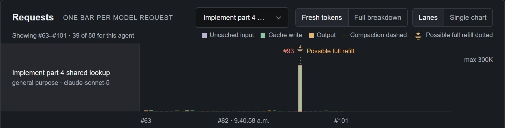
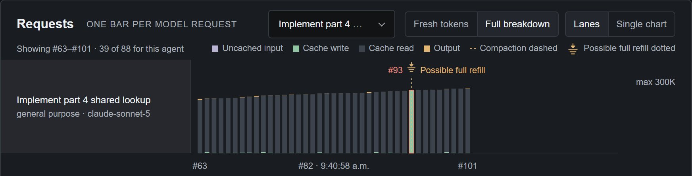

# Cache reuse

Prompt caching lets a provider reuse its processing of the unchanged beginning of
a request instead of processing it again. Pomegr shows the counts the provider
recorded, marks sharp drops in reuse, and labels every explanation as an
observation or an inference. It never inspects, refreshes, or clears the
provider's cache, and it does not show what a drop cost.

## Read reuse

A request's **Cache read** is the part of its prompt input the provider read from
its cache; see [Context and tokens](context-and-tokens.md#the-four-token-labels)
for the labels. On the **Activities** tab, **Full breakdown** stacks Cache read in
each bar of the **Requests** chart. Once a conversation is cached, each request
re-reads that prompt, so most of a typical bar is Cache read.

## Spot a possible full refill

A refill happens when the provider writes most of the prompt into its cache again
instead of reading it. Pomegr marks **Possible full refill** only when two
adjacent requests from the same agent and model, with no recorded compaction
between them, meet all four checks:

| Check | Evidence required |
| --- | --- |
| Input size | Both requests have at least 8,000 prompt input tokens. |
| Reuse before | The earlier request read at least 80% of its prompt input from cache. |
| Reuse at the drop | The later request read at most 10%. |
| Write at the drop | The later request recorded at least 8,000 Cache write tokens. |

A conversation's first request writes a large cache but has nothing earlier to
compare, so it is not marked. The two captures below show one request in both
chart modes.

*A real recorded Claude Code session in the Pomegr repository. In **Fresh tokens**,
which leaves out Cache read, request #93 is one tall Cache write bar under the
dotted marker. The other bars in this agent's lane are small.*

*The same requests in **Full breakdown**. Before and after #93 each bar is almost
entirely Cache read. #93 is mostly Cache write instead, so reuse dropped and
then returned.*

Hover or focus the affected bar to see any explanation Pomegr can support, each
labeled by its source:

- **Provider diagnostic.** Claude Code can record that the model configuration,
  system instructions, tool definitions, or message history changed. The
  refill icon on an agent's row in the **Agents** tab opens a popover that lists
  these, or "reason unavailable".
- **Inference.** When no recognized diagnostic explains the drop and more time
  passed since the preceding request than its recorded lifetime, the tooltip
  reads, for example, "Five-minute cache likely expired; 7m elapsed since the
  preceding request." That is Pomegr's reading of timestamps, not a provider
  statement.

## Drops without a recorded write

As of September 2026, Codex records lack reliable Cache write counts
([upstream issue](https://github.com/openai/codex/issues/35300)), so Pomegr
cannot mark a **Possible full refill** there. Instead, when reuse collapses
between adjacent requests from the same agent and model, with no cache write
recorded, it marks **Possible refill** and calls it an inference: "No positive
cache-write evidence, so a refill and its cause cannot be confirmed." If the
recorded model changed between the requests, the marker reads **Cache reuse
dropped across a model change** and makes no refill, expiry, or cause claim.

## Cache lifetime and elapsed time

A cache entry lasts a limited time after each write or read. Pomegr shows the
lifetime recorded for an agent's requests as **Cache lifetime** in the **Agents**
tab inspector and in the **Signals** tab (see
[Signals and estimates](signals-and-estimates.md)):

- **Claude Code:** `5m`, `1h`, or `mixed`, read from the provider's recorded
  cache-creation breakdown. Anthropic documents a five-minute default, a
  one-hour option, and a refreshed lifetime after each reuse
  ([prompt caching](https://platform.claude.com/docs/en/build-with-claude/prompt-caching)).
- **Codex:** **≥30m** for recognized GPT-5.6 and GPT-6 family models. OpenAI
  documents 30 minutes after the latest write or reuse as a minimum, so an
  entry may last longer
  ([prompt caching](https://developers.openai.com/api/docs/guides/prompt-caching#cache-lifetime)).
  Pomegr shows it as a documented minimum, never as an expiry.

For a `5m` or `1h` lifetime, Pomegr compares the newest **Last cache touch**, the
latest request that read or wrote cache, with the clock. On the **Sessions**
page, a small timer after a session's **Updated** time turns amber in the last
minute of a five-minute lifetime or the last five minutes of a one-hour lifetime,
then turns faint once it has elapsed. It follows the primary agent only, and older
sessions keep their recorded evidence. Hover or focus it for the times and state.

In the **Agents** tab, **Last request** is the time of an agent's newest request
that carries valid usage data; a provider summary or lifecycle update does not
change it. In the agent tree, that time gets the same dotted disclosure while the
agent's last cache touch is nearing or past a `5m` or `1h` lifetime. Finished and
stopped agents and historical sessions show the recorded time only.

## Limits

- **A pattern, not a cause.** A drop shows that recorded counts changed. It does
  not prove a cache expired, why reuse changed, or what the provider charged.
- **Elapsed is not dropped.** A lifetime that has passed does not prove the
  provider discarded the entry, and a prefix may never have been written.
- **Missing evidence stays unavailable.** Malformed counts, a compaction between
  requests, or requests from different agents prevent a marker. An unavailable
  lifetime shows no timer.
