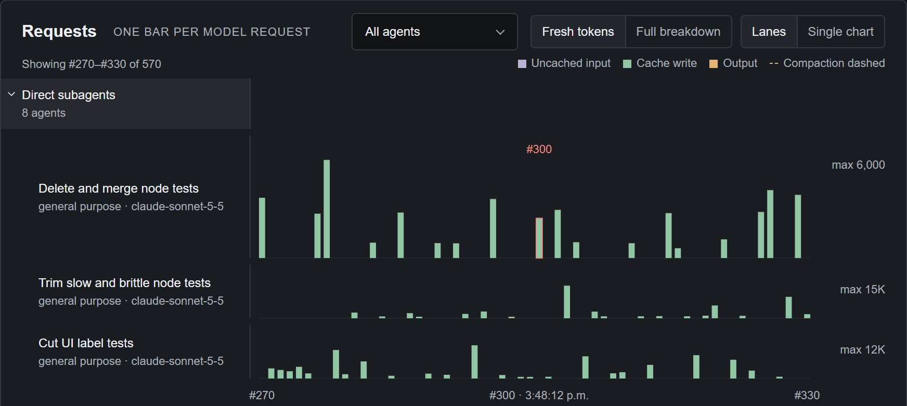
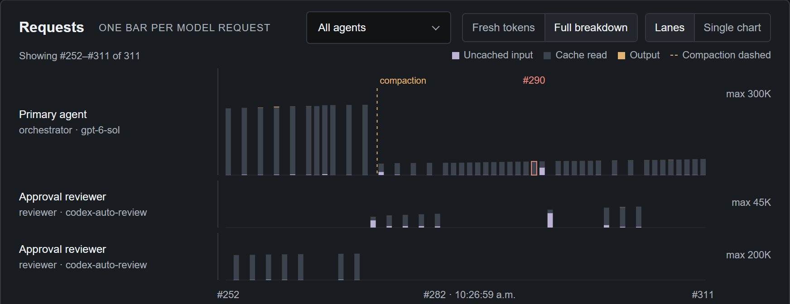

# Context and tokens

Context is the size of an agent's most recent recorded model request with
non-zero usage: the input it was sent plus the output it returned. It is a
snapshot of that request, not a running total, so it can fall as well as rise.
Pomegr does not present token spend.

## The four token labels

A token is a small unit of text a model processes, such as a word or part of one;
token counts are not word counts. Pomegr splits each request into four labels:

| Label | What it means |
| --- | --- |
| **Uncached input** | Input the provider processed without reading it from, or writing it to, the prompt cache. |
| **Cache write** | Input the provider stores in its prompt cache. A write does not guarantee a later read. |
| **Cache read** | Input reused from the prompt cache. It still counts as input. |
| **Output** | Tokens the model generated, which can include reasoning as well as the visible reply. |

Each input token belongs to one category, so cached input is never counted twice:

```text
Prompt input  = Uncached input + Cache write + Cache read
Request total = Prompt input + Output
```

A request also carries instructions, history, tool definitions, and file or tool
content, so input is often far larger than what you typed.

## Context and all-agent context

An agent's context is the request total of its latest recorded request with
non-zero usage. It appears as **Latest context**, and as **Final context** in a
recorded session's Agents tab. **All-agent context** in the summary strip adds
the latest context of each agent Pomegr observed in the session.

If the primary agent's latest request totals 30,000 tokens and a subagent's
totals 10,000, All-agent context is 40,000. That does not mean the agents share
context, or that the session holds 40,000 unique tokens.

## Read two requests

These numbers are illustrative. Imagine two requests from one agent, with
cache-write evidence available:

| Component | First request | Later request |
| --- | ---: | ---: |
| Uncached input | 2,000 | 1,000 |
| Cache write | 18,000 | 2,000 |
| Cache read | 0 | 18,000 |
| Prompt input | 20,000 | 21,000 |
| Output | 1,000 | 500 |
| Request total | 21,000 | 21,500 |

On the later request the provider reads 18,000 tokens from cache and writes
2,000 more. The share of its prompt input read from cache is 18,000 ÷ 21,000,
about 86%; output is excluded. Reuse changes how those tokens are processed, but
the request still carries 21,000 input tokens. This agent's context is now
21,500, the later request's total, not the sum of both requests.
[Cache reuse](cache-reuse.md) explains what a drop in reuse can and cannot mean.

The **Requests** chart on the **Activities** tab draws one bar per request.
**Fresh tokens**, the default, stacks uncached input, cache write, and output. It
leaves out cache read, which is usually far larger, so the smaller parts stay
readable. Choose **Full breakdown** to also stack cache read, so a bar shows the
whole request. In **Lanes**, each agent's lane has its own scale, so compare bars
within a lane.



*A real recorded Claude Code session in the Pomegr repository. In **Fresh
tokens**, Cache write is the largest visible part of these subagent requests.
Uncached input and output are barely visible, and the lane scales (6,000, 15K,
and 12K tokens) are small because cache reads are left out.*

## Spot a compaction

A compaction shortens the conversation carried into later requests, usually by
summarizing earlier detail. Pomegr observes the recorded event; it does not
compact anything. When it has recorded a compaction between two requests from
the same agent, the chart draws a dashed line labeled **compaction** between
them.



*A real recorded Codex session. Before the line, the primary agent's bars are
tall and almost entirely cache read. After it they are much shorter, so that
agent's latest context is smaller. It grows again as work continues.*

The **Agents** tab also shows an agent's compaction count as a small icon with a
number beside its name. Hover or focus the icon to see whether the provider
recorded the compactions as automatic or manual.

## Limits

- **Not spend.** Pomegr never sums token counts into a spend total or rate. When
  Claude Code local usage is enabled, the Overview **Cost** panel shows Claude
  Code's own "Claude Code API list-rate estimate," labeled "Estimate, not a
  bill." Without it, the panel does not appear. See
  [Token pricing](token-pricing.md).
- **Not proof of cause.** A smaller context without a recorded compaction gets no
  dashed line, and the drop alone does not prove one happened.
- **Provider differences.** Providers report usage differently. A missing value
  means unavailable, not zero.
- **No Cache write for Codex.** Pomegr omits **Cache write** and the cache-refill
  evidence that needs it (see [Cache reuse](cache-reuse.md)) for all Codex
  sessions, because Codex records lack reliable cache-write counts as of
  September 2026 ([upstream issue](https://github.com/openai/codex/issues/35300)).
  Cache reads remain available.
