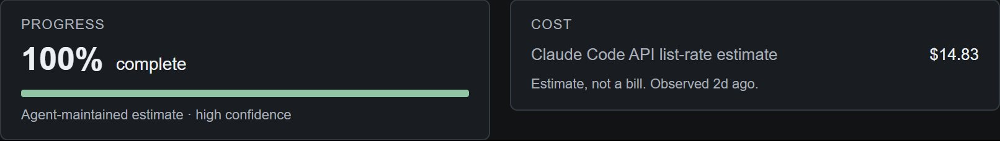
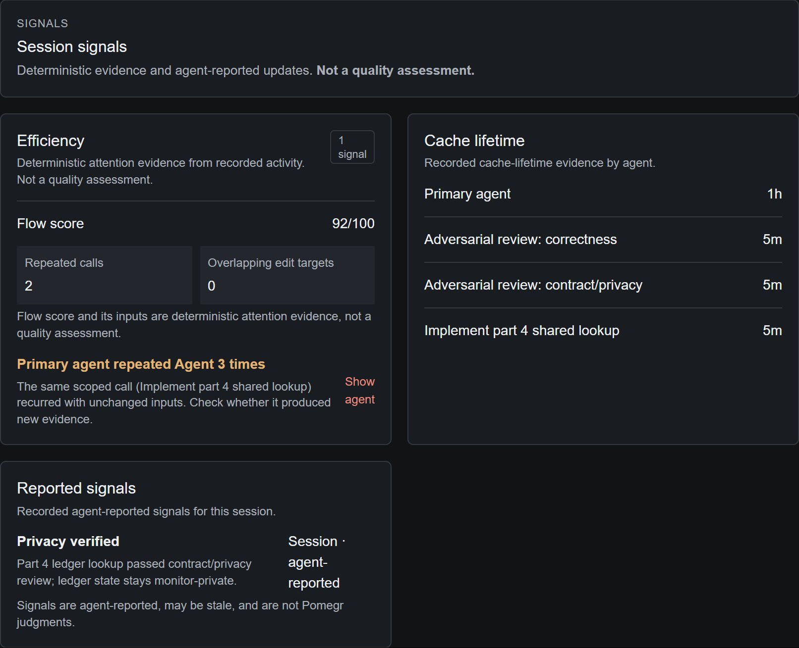

# Signals and estimates

Pomegr shows four kinds of information side by side and labels where each comes
from. Recorded values and provider estimates come from provider data, agent
reports come from the agent, and efficiency signals come from fixed Pomegr rules.
None of them is an AI judgment, a bill, or proof that work was good or bad.

## Four kinds of information

| Kind | Examples | Read it as |
| --- | --- | --- |
| Recorded | **Calls**, **Wall time**, [context](context-and-tokens.md), request counts | What the provider's records show. A gap in the records is unavailable, not zero. |
| Agent-reported | **Agent estimate**, **Progress**, **Reported signals** | What the agent said. It can be stale and Pomegr does not verify it. |
| Provider estimate | **Cost**, [usage limits](usage-limits.md) | The provider's own figure, not a bill. |
| Deterministic inference | **Efficiency**, Flow score, refill markers | A fixed rule applied to recorded evidence: the same evidence gives the same result. |

## Agent-reported progress and signals

Both depend on optional setup. An agent reports progress and signals through the
[Pomegr plugin](../using-pomegr/reporting-plugins.md), under a repository policy
that chooses what to report, and progress reporting is off unless the policy
enables it. Without a report, the
**Agent estimate** in the summary strip shows "—" with "No estimate recorded", and
**Reported signals** shows "No reported signals yet." (or "No reported signals
were recorded for this session." for a past session).

With a report, the Overview **Progress** panel shows the percentage, phase, and
confidence, labeled "Agent-maintained estimate", or "N/M agent-maintained plan
tasks" when the session has a plan checklist. An estimate keeps its last
reported value until the agent reports again, so it can be out of date. A
session's plan checklist is also agent-maintained and may be stale.

The **Cost** panel is a provider estimate (see
[Token pricing](token-pricing.md)). When Claude Code local usage is enabled, it
shows "Claude Code API list-rate estimate" and "Estimate, not a bill." It does
not appear otherwise, Codex has no estimate, and
[**Settings → Data display**](../using-pomegr/settings.md#show-or-hide-the-estimate)
can hide it.

*A real recorded Claude Code session in the Pomegr repository. The Progress
panel shows what the agent reported. The Cost panel shows Claude Code's own
estimate, observed two days earlier.*

## The Signals tab

The **Signals** tab keeps rule-based evidence apart from agent reports.

*The same session. Efficiency, Cache lifetime, and Reported signals are separate
sections, and the page says the evidence is not a quality assessment.*

- **Efficiency** lists rule results. **Flow score** starts at 100, subtracts 4
  for each repeated call (at most 45) and 7 for each overlapping edit target (at
  most 25), and never falls below 25. A repeated call is each identical call
  after the first, so a call made three times, like the "3 times" signal above,
  counts as two and gives 92. It is an attention heuristic, not a quality score.
- **Rule list.** The rules cover an automatic compaction, the same call repeated
  three or more times (except an agent's progress, signal, and session-title
  reports to Pomegr), two agents changing the same edit target within 30
  seconds, two or more agents changing the same file at any point in the session,
  one agent changing at least 20 files that no other agent changed, a primary
  context of at least 150,000 tokens with at least 40 calls
  and no subagent, and, for Claude Code, a cache miss and refill after an idle
  gap of at least 30 minutes (see [cache reuse](cache-reuse.md)). The two file
  rules count only changes made through an agent's file-editing tools, so a file
  written by a shell command is not included. With none, the section reads "No
  obvious loops right now". A signal invites a check; it does not say something
  went wrong.
- **Cache lifetime** lists each agent's recorded lifetime, and marks a
  documented minimum as not an expiry.
- **Reported signals** shows a bounded label, tone, optional one-line description,
  and a source line such as "Session · agent-reported". A session signal also
  appears as a chip in the session header. Pomegr shows no other content from the
  agent's call.

## Limits

- **Not judgments.** A signal, tone, or score does not rate the agent or the work.
- **Stale is possible.** Agent reports change only when the agent reports again.
- **Missing is not success.** No signal, no estimate, and no cost mean nothing was
  recorded, not that nothing happened.
- **No per-action cost.** Pomegr does not attribute tokens, cost, or usage to a
  request or action.
