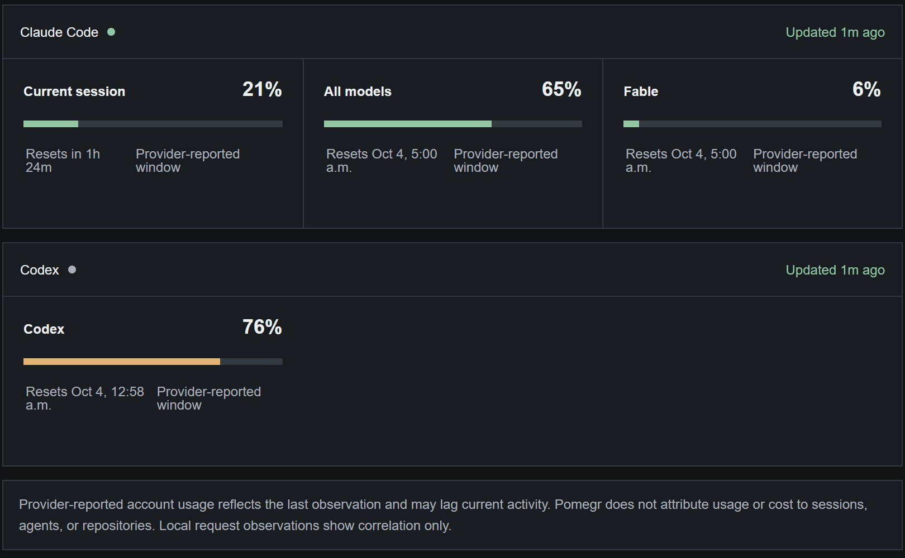

# Usage limits

**Usage limits** shows how much of each provider's account usage windows has been
used and when each window resets. The provider reports these figures for the
whole account, so they include work Pomegr never sees. Pomegr does not attribute
usage to a session, agent, or repository, does not forecast when a window will
run out, and does not show a bill.

## Read a window

Open **Usage limits** in the sidebar. Each provider has a card with one panel per
window: a label, the percentage used, a bar, the reset time, and the note
"Provider-reported window".

*A real Pomegr installation on 2026-09-30. Claude Code reports three windows
and Codex one. The Codex bar is amber because 76% is in the warning band.*

- **Claude Code:** **Current session** is a five-hour window. **All models** and
  **Fable** are seven-day windows; Fable appears when the provider reports it.
- **Codex:** one panel per window the account reports, each with its own reset
  time.

The sidebar's **Usage limits** widget repeats the highest window for each
provider that has a session created in the last seven days, such as "65% · 7
days". **View** opens the page. Percentages fall into fixed bands: 0% to 74% is
normal, 75% to 84% warning, and 85% to 100% critical. In the sidebar the figure
turns amber, then red; on the page the bar turns amber from 75%.

## How fresh a reading is

The time beside the provider name says how the reading arrived:

- **Updated** means Pomegr read the account's usage from the provider.
- **Last observed** means the figures came from Claude Code's own status line.
  Repeated identical values keep their original time.

Pomegr checks each provider at most every five minutes, shares one check across
every open browser tab, and waits out any cooldown the provider sets. When a
check fails, the last good figures stay visible and the header reads **Usage
access interrupted**, **Refresh rate-limited**, or **Refresh delayed**, with a
retry countdown when the provider gives one. A reading can lag activity
elsewhere on your account. Historical sessions never show current limits.

## Provider differences

| | Claude Code | Codex |
| --- | --- | --- |
| Source | The account, using the sign-in Claude Code saved | The installed Codex CLI's rate-limit snapshot |
| Optional | Local usage from Claude Code's status line | None |
| Requires | Claude Code signed in, for account checks | Native Codex CLI signed in with ChatGPT |

Claude Code's status line reports the five-hour and seven-day windows for Pro and
Max subscribers, after the first response in a session
([status-line documentation](https://code.claude.com/docs/en/statusline#rate-limit-usage),
checked September 30, 2026). It does not include the Fable window, so with local
usage Pomegr shows Fable separately as **Last API value** with its own time, or
**Checking…** and then **Unavailable** until an account check succeeds. Codex
access with only an API key does not supply these windows.

## If a window is missing

A missing window is unavailable, not zero. A failed check opens **Usage
connection help** automatically, even when older figures remain.

- **Codex CLI required for usage limits:** install or update the native Codex CLI
  on the computer running Pomegr, run `codex login` and sign in with ChatGPT, then
  fully quit and reopen Pomegr.
- **Usage access interrupted (Claude Code):** select **Reconnect Claude Code** in
  the desktop app, or run `claude auth login --claudeai` on the computer running
  Pomegr. Pomegr retries automatically afterward and never refreshes or copies the
  sign-in itself.
- **Refresh rate-limited:** wait for the countdown. Signing in again does not
  shorten a provider's cooldown.
- **No local usage:** when usage is unavailable, the installed Windows app offers
  **Enable local usage**, which asks for confirmation before it changes Claude
  Code's status-line setting. **Setup guide** opens
  [Claude Code local usage](../help/claude-local-usage.md), which also covers
  browser-only installations.
