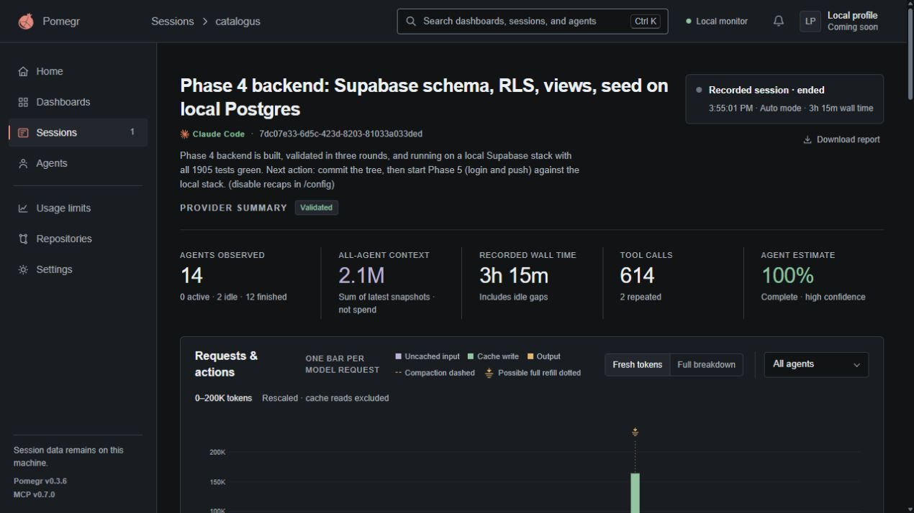
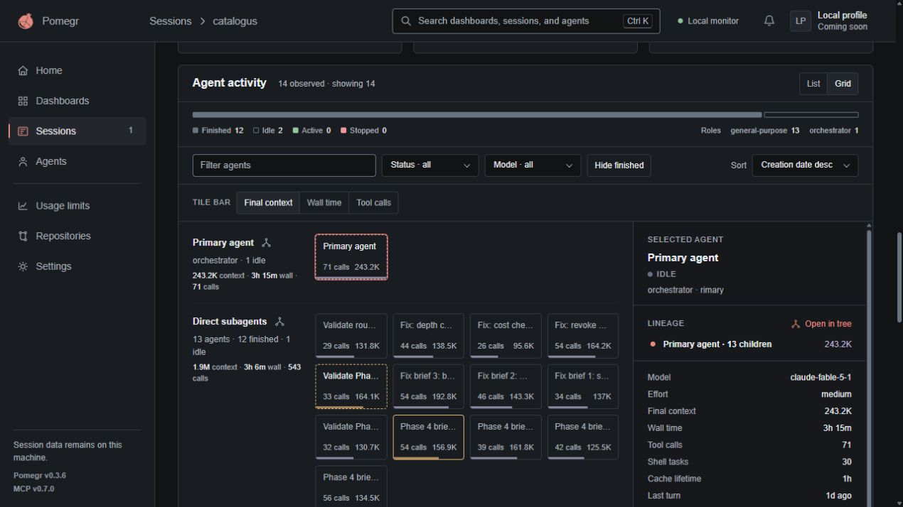
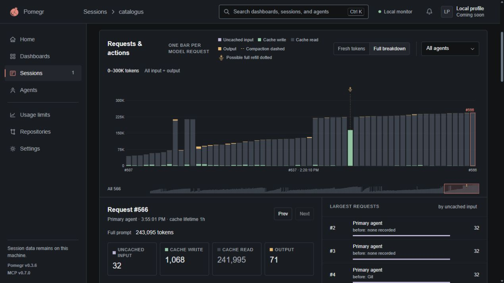
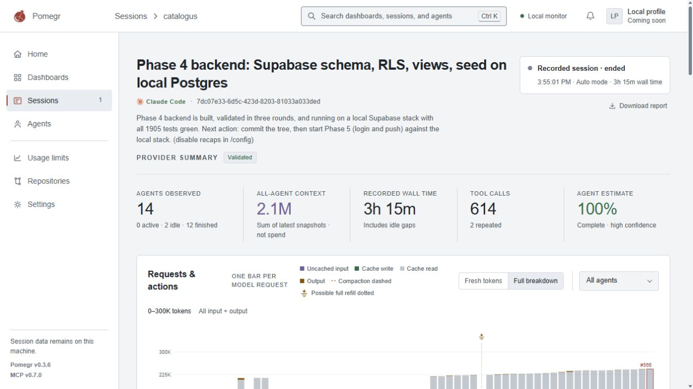

# Introduction to Pomegr

Pomegr helps you follow your coding agents at work. Open it alongside Claude Code
or Codex to see which sessions need attention, what each agent is doing, and how
much context it is using.

To get started, [install Pomegr](install.md) on your Windows computer, then
[follow your first session](first-session.md).

## A session at a glance

Here is Pomegr observing a session working on a project's backend. A primary
agent and 13 subagents handled implementation and validation.

*These screenshots show a real development session with recorded activity and
numbers.*

Read the page from the session overview down to the individual agents:

- **Agents observed** shows how many agents Pomegr has seen and their states.
- **All-agent context** adds each agent's latest context snapshot. It helps you
  see the size of the context across the team; it is not a token-spend total.
- **Tool calls** shows recorded tool use. Open an agent to inspect its activity
  and execution tasks, such as running a test or searching the project.

Below, **Agent activity** shows the team. Selecting the primary agent opens its
details on the right: context, wall time, tool calls, and more. Switch between
**List** and **Grid** to explore the same agents in different views.

## Look inside a request

The **Requests & actions** chart shows one bar per model request. Select a bar to
see its token breakdown and associated actions. **Full breakdown**, shown here,
includes cache reads; **Fresh tokens** excludes them. Each request is an
independent observation, not a running total or a cost per action.

## Follow more than one session

Use **Sessions** to move between active and historical work. **Agents** lets you
inspect agents across sessions, while **Repositories** groups work by project.
Check **Usage limits** for supported account windows when that information is
available.

Keep working in your coding tool. Pomegr observes existing session records without
controlling your agents or putting prompts, responses, and credentials in the
dashboard.

## Dark by default, with a light option

Dark mode is the default. A light theme is also available for the same dashboard
and controls.

## Know what the numbers can tell you

Claude Code and Codex expose different information. A missing value means Pomegr
does not have supported evidence; it does not prove inactivity or success.

Agent reports and provider estimates are labeled as such. Efficiency signals use
explainable rules to point out recorded patterns, not to grade your agent's work.
Wall time includes idle gaps.
