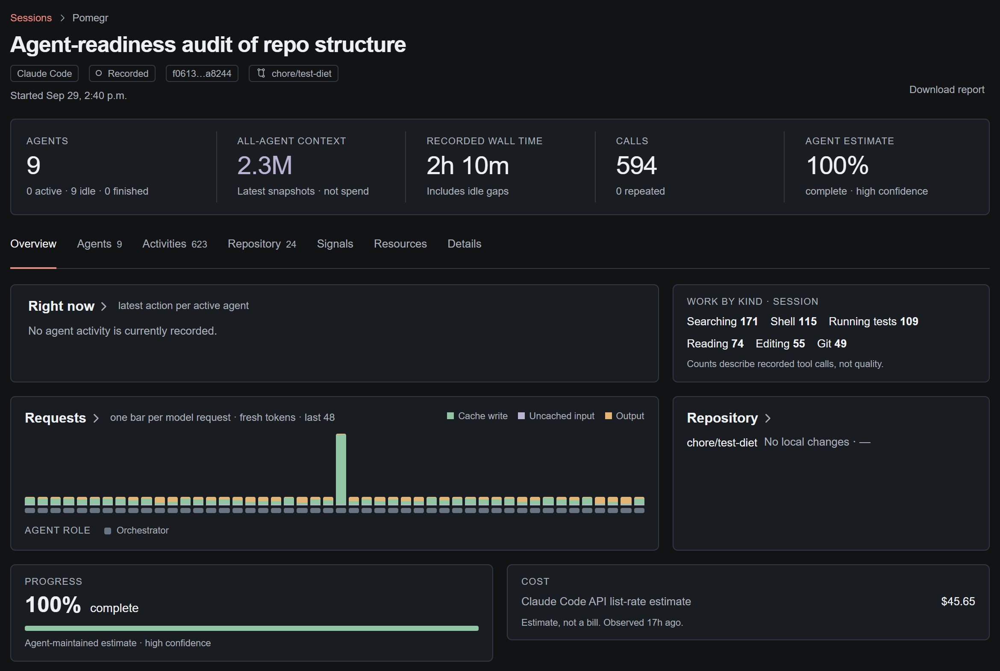
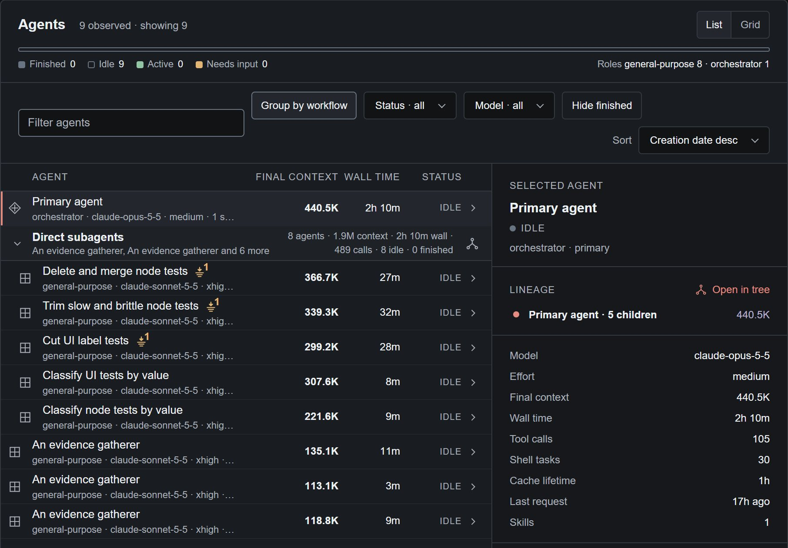
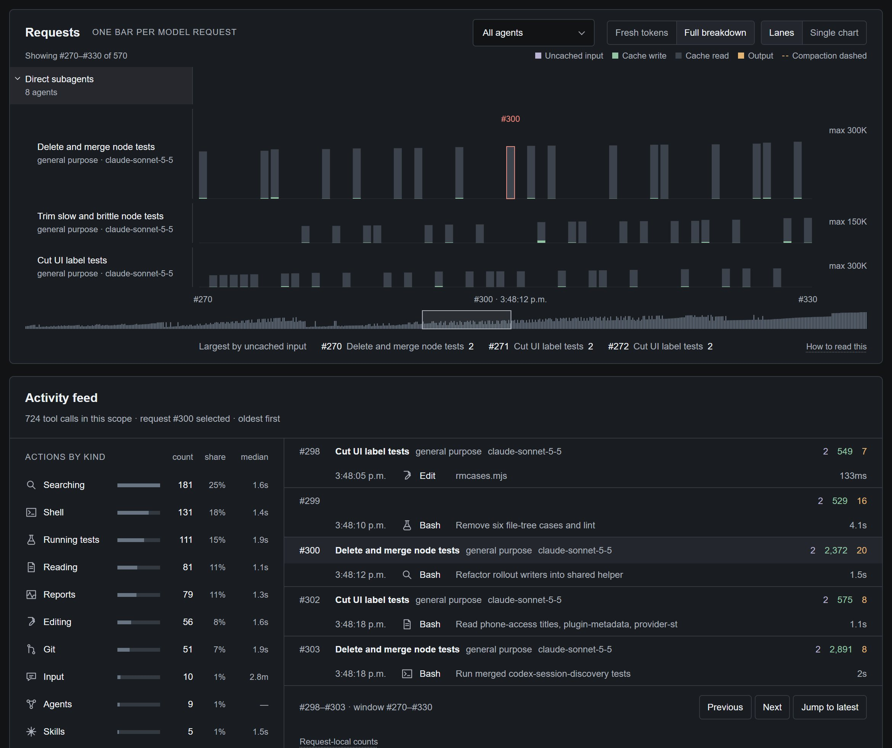
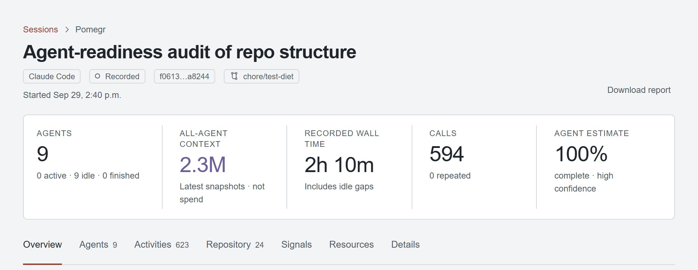

# Introduction to Pomegr

Pomegr helps you follow your coding agents at work. Open it alongside Claude Code
or Codex to see which sessions need attention, what each agent is doing, and how
much [context](../concepts/context-and-tokens.md) it is using.

To get started, [install Pomegr](install.md) on your Windows computer, then
[follow your first session](first-session.md).

## A session at a glance

Here is Pomegr showing a recorded Claude Code session: one primary agent and
eight subagents.

*A real recorded development session from the Pomegr project, with its actual
activity and numbers.*

A session opens with a header, a summary strip that stays in view, and tabs.
Read the strip from left to right:

- **Agents** shows how many agents Pomegr has seen and their states.
- **All-agent context** adds each agent's latest context snapshot. It does not
  mean the agents share context, and it is not a token-spend total. See
  [Context and tokens](../concepts/context-and-tokens.md).
- **Wall time**, or **Recorded wall time** for a recorded session, includes idle
  gaps.
- **Calls** shows recorded tool use, such as running a test or searching the
  project.
- **Agent estimate** is the progress the agent reported through the optional
  Pomegr reporting plugin, not a Pomegr measurement. Without a report the strip
  shows **No estimate recorded**.

The **Overview** tab summarizes the session; **Agents**, **Activities**,
**Repository**, and **Signals** go deeper. **Resources** appears when Pomegr has
resource data for the session, and **Details** lists further session facts.

## Meet the agents

Open the **Agents** tab to see the team. Selecting an agent opens its details on
the right: model, context, wall time, tool calls, cache lifetime, and more. Filter
or group the roster, and switch between **List** and **Grid** to explore the same
agents in different views.

*The same session's Agents tab, with the primary agent selected.*

## Look inside a request

The **Requests** chart on the **Activities** tab shows one bar per model request,
with a lane for each agent so you can see subagents work side by side. Each lane
has its own scale; **Single chart** combines them. Select a bar, or a request in
the **Activity feed** below the chart, to see its recorded actions. **Full
breakdown**, shown here, includes cache reads; **Fresh tokens** excludes them.
Each request is an independent observation, not a running total or a cost per
action.

*The same session's Requests chart around request 300.*

## Follow more than one session

Use **Sessions** to move between live and recorded work. **Models & delegation**
shows which models your agents use and how work is delegated, while
**Repositories** groups work by project. Check **Usage limits** for supported
account windows when that information is available.

Dark mode is the default. Switch to the light theme from the **Local profile**
menu, or set **Color theme** under **Settings → Appearance**.

*The same session in the light theme.*

Keep working in your coding tool. Pomegr observes existing session records without
controlling your agents or putting prompts, responses, and credentials in the
dashboard.

## Know what the numbers can tell you

Claude Code and Codex expose different information. A missing value means Pomegr
does not have supported evidence; it does not prove inactivity or success.

Agent reports and provider estimates are labeled as such, like **Agent estimate**
and the Overview **Cost** panel's "Estimate, not a bill." That panel appears only
for Claude Code sessions with local usage enabled. Efficiency signals on the
**Signals** tab use explainable rules to point out recorded patterns, not to
grade your agent's work. Wall time includes idle gaps.
