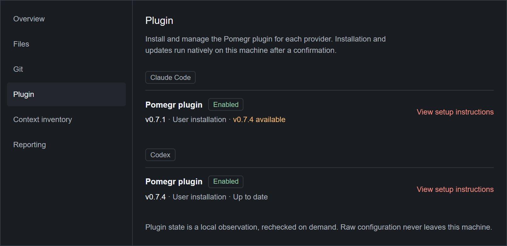
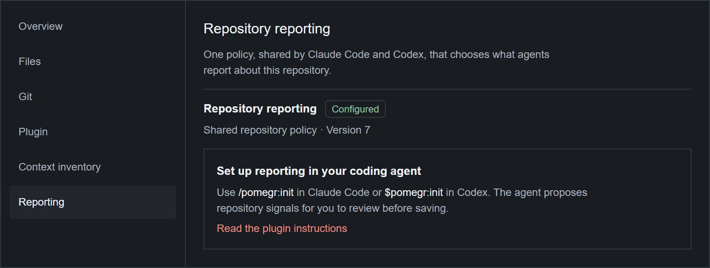

# Reporting plugins

The Pomegr plugin is optional; Pomegr observes your sessions without it. With it,
the agents in a repository can report a short status, a task outcome, and a
progress estimate, and they can read Pomegr's
[MCP observation queries](mcp-queries.md). The plugin sends no transcript
contents, prompts, or credentials to Pomegr. Everything an agent reports is
agent-reported and can be out of date; it is never a Pomegr judgment (see
[Signals and estimates](../concepts/signals-and-estimates.md)).

## Install the plugin

Install it once for each coding tool, on the computer where you run it. The
desktop app can also do it from a repository's **Plugin** tab (see
[Check the setup in Pomegr](#check-the-setup-in-pomegr)).

### Codex

Run these commands, then restart Codex and start a new task:

```powershell
codex plugin marketplace add Lecarvalho/pomegr --ref main
codex plugin add pomegr@pomegr
```

Open `/hooks`, review the Pomegr hooks, and trust them. Codex does not trust
plugin hooks automatically and asks again when one changes. Replace `main` with a
published release tag to pin a version.

### Claude Code

Enter these commands and choose **Project** when asked for the installation
scope:

```text
/plugin marketplace add Lecarvalho/pomegr
/plugin install pomegr@pomegr
/reload-plugins
```

### Update the plugin

Select **Update plugin** in the desktop app, or run the update yourself and start
a new session. For Codex:

```powershell
codex plugin marketplace upgrade pomegr
codex plugin add pomegr@pomegr
```

For Claude Code, replace `project` with the scope you installed with (`user`,
`project`, or `local`), then run `/reload-plugins`:

```powershell
claude plugin marketplace update pomegr
claude plugin update pomegr@pomegr --scope project
```

## Set up a repository

Until a repository has a reporting policy, the plugin reports nothing
project-specific. In the repository, run `/pomegr:init` in Claude Code or
`$pomegr:init` in Codex (called `init` below). The agent asks which outcomes an
observer should notice and shows the complete policy or a diff. It writes `.pomegr/signals.md` only after
you confirm and never replaces an existing policy blindly. Both coding tools share
the policy, and each new session loads it at start. A missing or unreadable
policy, or Pomegr not running, never blocks the session.

`/pomegr:doctor` and `$pomegr:doctor` give a read-only checklist that changes no
files and reports no signal.

## What agents report

| Report | Shows in | Lasts |
| --- | --- | --- |
| Session signal | The session header chip and **Reported signals** on the **Signals** tab. | Until replaced or cleared. |
| Agent signal | The **Signals** section of the agent inspector. | Until replaced or cleared. |
| Task signal | A chip on the matching shell task. | Never cleared; a later report can replace it. |
| Progress | The Overview **Progress** panel and the **Progress** column. | Until replaced or cleared. |

A signal is a short plain-text label, a tone (`neutral`, `info`, `positive`,
`warning`, or `negative`), and an optional one-line description. Progress is off
unless the policy enables it. Pomegr shows only these bounded fields, never
prompts, responses, commands, or tool output. Claude Code can also set a concise
session title.

The optional usage guard, off until you ask `init` to create
`.pomegr/usage-guard.json`, adds advisory warnings from Pomegr's cached usage
observations. It never blocks a prompt or tool call, and its thresholds are a
fixed rule, not a quota guarantee.

## Check the setup in Pomegr

Open **Repositories**, select a repository, and open its **Plugin** tab. Each
coding tool has a **Pomegr plugin** row with a chip (**Enabled**, **Disabled**,
**Not installed**, **Unable to verify**, or **Checking plugin setup**), the
installed version and scope, and whether an update is available.



*The Pomegr project's own repository, a real development view captured on
2026-09-30 from Pomegr 0.5.3 in a browser, so the desktop-only buttons are
absent.*

In the desktop app, **Recheck** reads the local records again. **Install plugin**
and **Update plugin** appear only when Pomegr can verify the official source and
version, and each first shows a native confirmation with the repository, coding
tool, scope, and versions. A browser shows **View setup instructions** instead.
Update availability compares with the official marketplace and is cached for an
hour. **Unable to verify** means Pomegr could not read the local records, not that
the plugin is missing.

The **Reporting** tab shows the policy as **Configured** with its version,
**Not configured**, **Invalid**, or **Unavailable**. Pomegr never creates or
changes it; use `init` as above.



*The same real Pomegr development view.*

## If reporting is missing

Start with `/pomegr:doctor` or `$pomegr:doctor`, then match the symptom:

- **No policy loaded in Codex.** Trust the Pomegr hooks in `/hooks`, then start
  or resume a task. Trust them again after an update changes a hook.
- **No policy loaded in Claude Code.** Run `/reload-plugins`, then start or
  resume a session.
- **Policy invalid or old.** Run `init` and review the proposed update.
- **A subagent did not report.** Its type must be in the policy's delegated agents,
  and it must keep the Pomegr MCP tools.
- **Tools missing.** Check `/mcp`, confirm the plugin is enabled, reload or
  reinstall it, and start a new session.
- **Claude Code session stays untitled.** Confirm `rename_session` appears in
  `/mcp`; otherwise the provider's automatic title stays.

A session keeps the plugin version it loaded, so an update affects only sessions
that start afterward.
