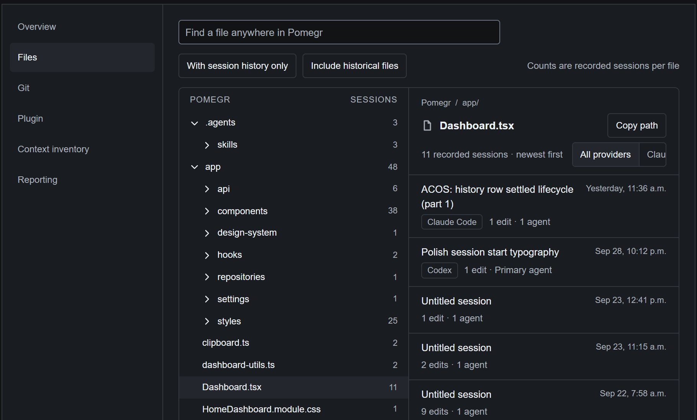
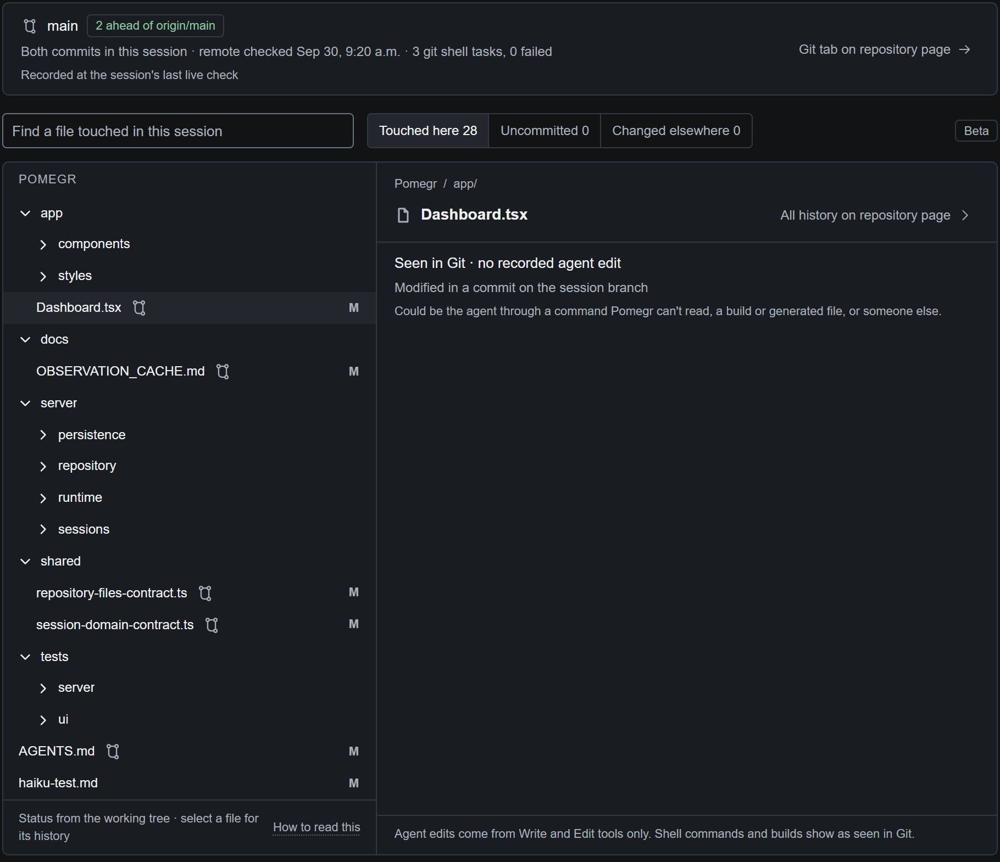

# Repositories

**Repositories** groups the sessions that worked in the same Git project. Open a
repository to see the files its sessions changed, and open a session's
**Repository** tab to see what that one session touched. Pomegr reads all of it
locally and read-only, and its file history is partial by design.

## Find a repository

1. Select **Repositories**. Each row shows the repository name, its observed
   sessions and last activity, its coding tools, live and history counts, and a
   setup chip.
2. Type in **Filter repositories**, or choose **Needs attention** or **Live now**.
3. Select a row to open the repository.

The setup chip summarizes the optional Pomegr plugin and reporting policy (see
[Reporting plugins](reporting-plugins.md)). It is a local observation, and
sessions appear without either. **Ready** means nothing needs attention. A
warning chip, such as **Plugin update available**, **Plugin not installed**,
**Plugin disabled**, or **Reporting invalid**, also appears under
**Needs attention**. **Checking setup**, **Reporting not configured**, and
**Setup unverified** are neutral: Pomegr is still checking, has no policy to
read, or could not verify the setup.

## Open a repository

The header shows live and history counts and the coding tools observed.
**View sessions** opens **Sessions** for this repository; select the close
button on its **Repository:** chip to list every session again. The tabs are:

| Tab | What it shows |
| --- | --- |
| **Overview** | Counts, last activity, setup cards, and the five most recent sessions. |
| **Files** | Files that recorded sessions changed, with each file's history. |
| **Git** | Recent commits from the newest live session's working tree. |
| **Plugin** | Plugin installation state for each coding tool; see [Reporting plugins](reporting-plugins.md#check-the-setup-in-pomegr). |
| **Context inventory** | A saved diagnostic of what a coding tool loads first, what stays on demand, and what it reserves for compaction. |
| **Reporting** | The repository's reporting policy. |

**Git** shows "Commits appear while a session in this repository is live." until
one is. **Plugin** and **Context inventory** change only from the desktop app,
after a confirmation; a browser shows what Pomegr last observed or saved.
Branch, working-tree, and pull-request detail is not on the repository page: it
appears per session, in the **Repository** tab described below.

## See the files sessions changed

1. Open **Files**. The number beside each file or folder counts the recorded
   sessions that changed it.
2. Search with **Find a file anywhere in** the repository. **With session history
   only** hides files without a recorded change, and **Include historical
   files** adds deleted files.
3. Select a file. Its sessions appear newest first, each with an edit count and
   its agents. A **Created**, **Deleted**, or **Moved** chip marks the rarer
   kinds; a plain edit has none. **Copy path** copies the file's
   repository-relative path. Select a session to open its **Repository** tab.

*The Pomegr project's own repository, built from real recorded development
sessions and captured on 2026-09-30, cropped to the tab bar and Files view.*

> **Note:** File history covers recorded Write and Edit operations, including
> Codex patches. Shell commands, builds, and external editors can change files
> Pomegr never records, so a missing entry does not mean a file was unchanged.
> An edit count is recorded operations, not lines or commits.

## Read a session's Repository tab

Open a session and select **Repository**. The top bar shows the recorded branch,
its comparison with the default branch, commits in the session, and any pull
request. For a session that is no longer live it says "Recorded at the session's
last live check": Pomegr shows what it recorded then, never today's working tree.
The commit count (for example "3 commits in this session") counts every commit on
the branch during the session, including other people's, so it does not attribute
them to the session.

**Touched here** lists files with a recorded change, plus files Git saw change
during the session. **Uncommitted** lists the touched files that were
uncommitted at the last check, and **Changed elsewhere** lists the uncommitted
files the session did not touch, so no file appears in both. The **Beta**
chip means file coverage is still growing.

*A real recorded Claude Code session from the Pomegr project. Files with the Git
glyph were seen by Git, not recorded as agent edits.*

Select a file with a recorded change to see **Recorded in this session**, its
kind, its change count, and the agents that made it. A file with the Git glyph
shows "Seen in Git · no recorded agent edit" instead. Git observed the change, but
it could be the agent through a command Pomegr cannot read, a build or generated
file, or someone else. Pomegr never attributes a Git-observed file to an agent or
counts it as a recorded edit.
