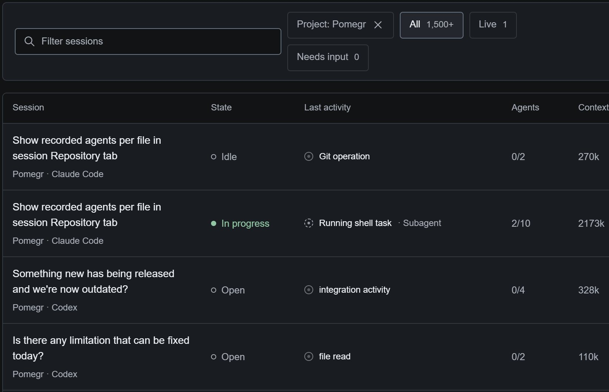
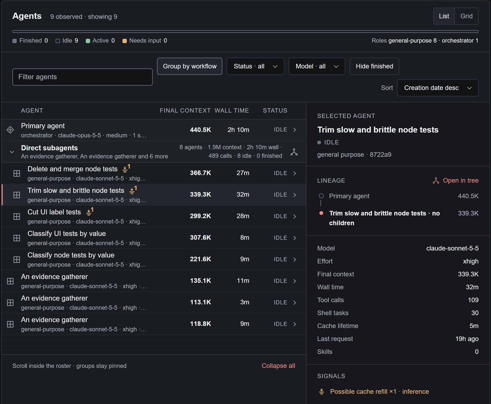

# Sessions and agents

**Sessions** lists every coding-agent session Pomegr has found, live or recorded.
Open one to see its agents. A state label describes what Pomegr could observe,
not whether the work succeeded.

## Find a session

1. Select **Sessions**. It starts on **Live** when any session is live, otherwise
   on **All**. **Needs input** narrows the list to sessions waiting for you. A
   count sits beside each filter.
2. Type in **Filter sessions** to match a session title, project, or coding tool.
   Some links open the list already filtered to one project and add a
   **Project** chip; select its close button to clear it.
3. Read a row, then select its title to open the session. The list shows 25 rows
   per page; use **Previous** and **Next**.

*Real Pomegr development sessions, captured on 2026-09-30 and cropped to the
first columns. One session was In progress at that moment.*

| Column | What it shows |
| --- | --- |
| **State** | The session state, as described below. |
| **Last activity** | The latest recorded activity. A dashed marker means it is current; a solid marker means it is the last one recorded. |
| **Agents** | Active agents over total agents, such as `2/10`. |
| **Context** | The sum of each agent's latest [context](../concepts/context-and-tokens.md) snapshot, in thousands of tokens. It is not spend. |
| **Progress** | The percentage the agent reported through the optional [Pomegr plugin](reporting-plugins.md). |
| **Updated** | When Pomegr last recorded activity. A small clock beside it opens the cache timer; see [Cache reuse](../concepts/cache-reuse.md). |

A dash means the value is unavailable, not zero.

## Read a session's state

| State | What Pomegr observed |
| --- | --- |
| **In progress** | An agent is working, or recorded background work is still open. |
| **Needs input** | An agent is waiting for you. This label wins even while other agents work. |
| **Idle** | The primary agent is idle, or Pomegr detects no live session and has no confirmed closure. It does not mean the work finished or succeeded. |
| **Open** | Pomegr confirmed the coding tool's process is present, but no work is confirmed running. |
| **Stopped** | Codex only: the latest recorded turn failed or was interrupted. |
| **Closed** | Claude Code only: Pomegr confirmed that the session's Claude Code process ended. It reports the closure, not that the work succeeded. After Pomegr restarts, the session can show **Idle** again until Pomegr sees new closure evidence. |
| **Unknown** | Pomegr lacks usable evidence. It never turns silence into completion. |

An **Open** session moves from **Live** to **All** five minutes after its last
recorded activity, and keeps its state. A session that Pomegr no longer sees as
live shows **Recorded** in its own header instead of a state.

## Inspect the agents

1. Open a session and select the **Agents** tab. The header of the roster counts
   agents by state and role; **List** and **Grid** show the same agents in two
   layouts.
2. Use **Filter agents**, **Group by workflow**, **Status**, **Model**,
   **Hide finished**, and **Sort** to narrow the roster.
3. Select an agent. Its details open on the right.

*A real recorded Claude Code session from the Pomegr project, cropped to the
roster and the selected subagent.*

A row names the agent, then its role, model, and effort, its **Latest context**
(**Final context** for a recorded session), **Wall time**, and status. The
details add **Lineage** with **Open in tree**, **Tool calls**, **Shell tasks**,
**Cache lifetime**, **Last request**, and **Skills**. **Activities for this agent**
opens its requests. **Cache lifetime** and refill markers are explained in
[Cache reuse](../concepts/cache-reuse.md).

| Agent status | What it means |
| --- | --- |
| **active** | Recorded activity within about 45 seconds. |
| **warm** | Last activity within five minutes. |
| **idle** | No recorded activity for more than five minutes. |
| **waiting** | A parent waiting on a subagent that is still working. |
| **needs input** | The agent asked for input and has no matching answer yet. |
| **finished** | A subagent ended its turn, or its parent recorded that it completed. |
| **stopped** | A parent stopped the subagent, or recorded that it failed or was cancelled. |

Roles are display labels chosen by fixed rules, such as `orchestrator` or
`general-purpose`. An agent with no known role shows `custom: <type>` when its
recorded type is safe to display. Wall time includes idle gaps. These labels and
the numbers beside them are recorded or deterministic, never a judgment of how
well an agent worked.

## If a value is missing

Loading placeholders mean Pomegr is still preparing a section, and
**No recorded activity yet** means the session has no recorded activity to
show. For an empty list, see [Missing sessions](../help/missing-sessions.md); for
an unavailable catalog, see [Connection problems](../help/connection-problems.md);
for other missing values, see [Unavailable data](../help/unavailable-data.md).
To compare models and delegation across sessions, open **Models & delegation**;
for the files a session touched, see [Repositories](repositories.md).
