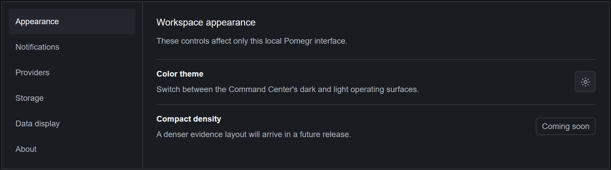
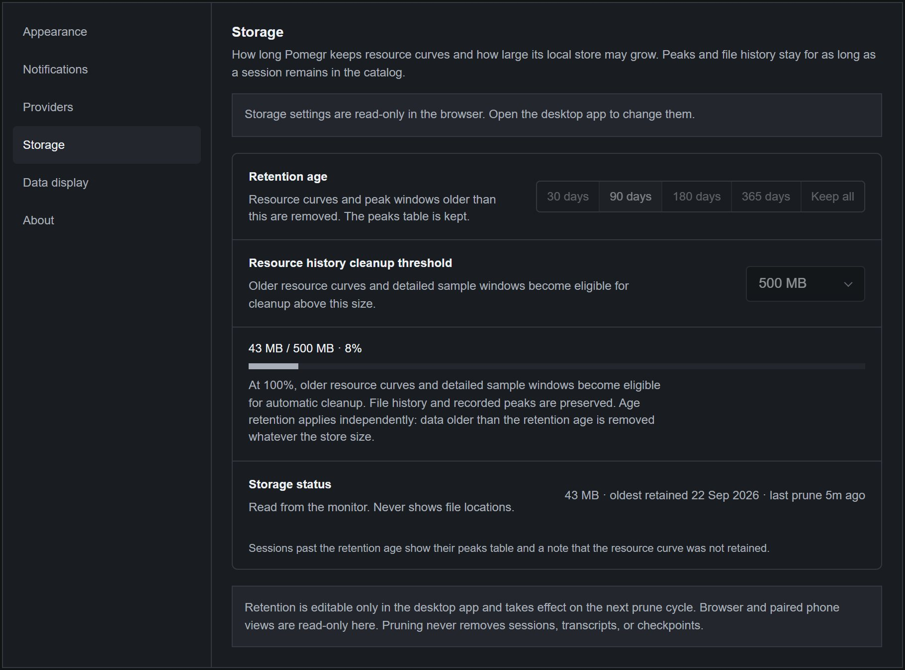

# Settings

**Settings** changes how Pomegr looks, which local folders it observes, and how
long it keeps its own resource history. It never controls your coding agents;
Pomegr stays read-only. Some tabs change only in the desktop app, and a browser
shows them read-only.

## Find a setting

Select **Settings** in the sidebar. **Restore defaults** resets only the **Data
display** preference.

*Pomegr 0.5.3 running in a browser on the project's own development machine,
captured on 2026-09-30.*

| Tab | What it does | Available in |
| --- | --- | --- |
| **Appearance** | Switches the **Color theme** between dark and light. **Compact density** is marked **Coming soon**. | Desktop app and browser |
| **Notifications** | Explains needs-input alerts. **Needs-input alerts** reads **Desktop managed** and **Completed session updates** reads **Coming soon**. | Desktop app and browser |
| **Phone access** | Shares the dashboard, read-only, with a paired phone on your private network. | Desktop app only |
| **Providers** | Chooses the Claude Code and Codex folders Pomegr observes. | Change in the desktop app; view in a browser |
| **Storage** | Limits how long and how large Pomegr's resource history grows. | Change in the desktop app; view in a browser |
| **Data display** | Shows or hides the **API list-rate estimate**. | Desktop app and browser |
| **About** | Shows the version, updates, privacy notes, and license. | Desktop app and browser; update controls only in the desktop app |

A browser on the same computer, or a paired phone, sees **Providers** and
**Storage** without the controls that change them. Alerts and the other
desktop controls exist only in the desktop app.

## Choose provider folders

Use **Providers** when your coding tool keeps its history outside the default
locations. For the steps, see
[If you use a different profile](../get-started/first-session.md#if-you-use-a-different-profile).
In the desktop app, each row shows **Default folder**, **Launch environment**, or
**Custom folder**, and whether the folder is available; an available folder may
hold no sessions.
Select **Use default** to remove a saved choice or **Discard changes** to undo
pending ones. Nothing changes until **Save and restart Pomegr**. Pomegr does not
move files or change a running coding tool's account. A browser shows the
effective folders as read-only text, or **Path unavailable**.

## Manage storage

1. In the desktop app, open **Settings → Storage**.
2. Choose a **Retention age**: 30, 90, 180, or 365 days, or **Keep all**.
3. Choose a **Resource history cleanup threshold**: 250 MB, 500 MB, 1 GB, or
   2 GB.
4. Select **Save and restart Pomegr** and review the native confirmation. Pomegr
   applies the values at its next start and pruning cycle. Unset values use the
   defaults, 90 days and 500 MB.

*The same development install. This browser view is read-only, so the controls
are disabled.*

Pruning only trims Pomegr's own resource curves and detailed sample windows. It
never removes sessions, transcripts, checkpoints, file history, or recorded
peaks. A session older than the retention age keeps its peaks table and shows a
note that its resource curve was not retained. **Storage status** reports the
size, the oldest retained day, and the last prune.

## Show or hide the estimate

**API list-rate estimate** shows the provider-reported estimate on a session's
Overview **Cost** panel. It is not a bill or subscription spend, and it appears
only when Claude Code local usage is enabled. See
[Signals and estimates](../concepts/signals-and-estimates.md). The preference
applies to every live and recorded session and is saved in that browser or in the
desktop app.

## Use the desktop controls

The desktop app puts an icon in the Windows notification area. Its menu offers
**Open Pomegr**, **Pause live refresh** (then **Resume live refresh**),
**Launch at login**, **About Pomegr**, and **Quit Pomegr**.

- **Pause live refresh** pauses dashboard polling only. It does not touch your
  coding agents, and it is not saved.
- **Launch at login** is opt-in and works only in the installed app.
- The first time you close the window, Pomegr asks whether to keep running in the
  tray or quit, with **Remember my choice**. Closing to the tray keeps observing;
  **Quit Pomegr** stops it.
- When a live session starts needing your input, Pomegr shows a Windows
  notification titled "Pomegr" that says "A coding-agent session needs input".
  It never includes a session title, question, or command, and selecting it
  opens that session. The alerts are on by default; Settings has no switch for
  them yet, and Windows notification settings can silence them.
- **Settings → About** shows the installed version, **Check for updates**, and
  **Restart and install**. A portable build never checks for updates. See
  [Keep Pomegr up to date](../get-started/install.md#keep-pomegr-up-to-date).
