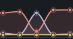
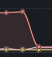

# Understanding tokens and cache

[Documentation](README.md)

Jump to [costs and percentages](#how-token-costs-are-calculated) or
[when caching is worth it](#when-caching-is-worth-it).

Pomegr shows how much information an agent used for a model request and how much
of that input came from cache. Start with the four labels below, then use the
example to read your own session.

## What is a token?

A token is a small unit of information a model processes. In text, it can be a
word, part of a word, or punctuation. Token counts vary with the model and
language, so they are not word counts.

**Input** is what the model receives for a request. **Output** is what it
generates. Output can include internal reasoning as well as the visible answer,
depending on what the provider reports. See
[OpenAI's token explanation](https://help.openai.com/en/articles/4936856-what-are-tokens-and-how-to-count-them).

## The four labels in Pomegr

| Label | What it means |
| --- | --- |
| **Uncached input** | Input counted outside cache reads and cache writes. This can include new material or older material that is being processed again. |
| **Cache write** | Input the provider processes and stores in its prompt cache for possible reuse. A write does not guarantee a later read. |
| **Cache read** | Input the provider reuses from an existing prompt cache. It is still part of the request's input. |
| **Output** | Tokens generated for that request. The count can be larger than the visible reply. |

Cache read and cache write are two ways of handling **input**, not extra
responses. In Pomegr's breakdown, each input token belongs to one category:

**Prompt input = Uncached input + Cache write + Cache read**

**Request total = Prompt input + Output**

Providers report these counts differently. Pomegr uses the labels above to avoid
counting cached input twice. Where a provider does not supply reliable
cache-write evidence, Pomegr omits that category.

## How caching works

A coding agent can send instructions, conversation history, tool definitions,
and file or tool content with a request. That is why a short message from you can
accompany a large input count.

Prompt caching lets the provider reuse processing for a matching beginning of
the input, often called a **prefix**. A later request can read an existing prefix
from cache and write additional input. The model still generates output for the
new request. See
[Anthropic's explanation of prompt caching](https://platform.claude.com/docs/en/build-with-claude/prompt-caching).

Pomegr observes the reported counts. It does not create, refresh, or clear the
provider's cache.

## A worked example

Imagine two requests from one agent, with cache-write evidence available. These
numbers are illustrative:

| Component | First request | Later request |
| --- | ---: | ---: |
| Uncached input | 2,000 | 1,000 |
| Cache write | 18,000 | 2,000 |
| Cache read | 0 | 18,000 |
| **Prompt input** | **20,000** | **21,000** |
| Output | 1,000 | 500 |
| **Request total** | **21,000** | **21,500** |

On the first request, the provider writes 18,000 input tokens to cache. On the
later request, it reads 18,000 tokens from cache and writes another 2,000.

The later request's **cache-read share** is 18,000 ÷ 21,000, or about **86%**.
Output is excluded from that percentage.

The later request still has 21,000 input tokens. Cache reuse changes how those
tokens are processed; the cached content remains part of its context. Read each
column as an independent request. Pomegr does not add the columns into a session
token-spend total.

## How token costs are calculated

**A cache read can cost much less than ordinary input, while writing a new
cache can cost more. Output has its own rate.** These are API token prices;
they do not translate directly into a percentage of a Claude Code or Codex
subscription allowance.

Prices checked **September 2, 2026**. Use the linked provider pages for current
rates. The examples below use standard direct API pricing, excluding taxes,
tool fees, regional premiums, special processing tiers, and long-context
surcharges.

### With cache versus without cache: what percentage do you pay?

Treat the price of processing the **same number of ordinary input tokens on
the same model as 100%**. These percentages apply to the specified input
category, not the whole request.

| Provider / model | Input treatment | You pay | Compared with ordinary input |
| --- | --- | ---: | --- |
| All models below | Uncached input | **100%** | Baseline |
| Claude models with the usual cache-read rate | Cache read | **10%** | 90% less |
| Claude Fable 5.1 / Mythos 5.1 | Cache read | **2.5%** | 97.5% less |
| Claude | Five-minute cache write | **125%** | 25% more |
| Claude | One-hour cache write | **200%** | 100% more |
| GPT-5.6 Sol / Terra / Luna | Cache read | **10%** | 90% less |
| GPT-5.6 Sol / Terra / Luna | Cache write | **125%** | 25% more |

Sources: [Claude cache pricing](https://platform.claude.com/docs/en/build-with-claude/prompt-caching#pricing)
and [OpenAI API pricing](https://developers.openai.com/api/docs/pricing).
The percentages are calculated from those published rates.

A 125% write rate is the **total rate for those written tokens**, not an extra
125% added to ordinary input. Count those tokens once at the write rate.
Earlier OpenAI models have different caching rules, including no additional
cache-write premium; check the
[model comparison](https://developers.openai.com/api/docs/guides/prompt-caching#summary-of-model-differences).

Output still costs **100% of the model's output rate** with or without prompt
caching. That output rate can be higher than its ordinary input rate.

### Calculate a request's token charge

Providers commonly quote prices per **one million tokens**:

**Category charge = Tokens in that category × Price per million ÷ 1,000,000**

Calculate the uncached-input, cache-write, cache-read, and output charges
separately, then add them. If writes use different lifetimes and prices, split
them into separate charges too. Cached tokens already included in a provider's
input total must not be counted again as ordinary input.

### Example including output charges

Take **Claude Sonnet 4.6** at $3 per million ordinary input tokens, $0.30 per
million cache reads, $3.75 per million five-minute writes, $6 per million
one-hour writes, and $15 per million output tokens.
[Claude's price list](https://platform.claude.com/docs/en/about-claude/pricing)
supplies these rates.

Each hypothetical scenario below has **100,000 input tokens and 2,000 output
tokens**. In the cache scenarios, 90,000 input tokens are read or written and
10,000 remain uncached. These are educational examples, not measurements from
your session or either screenshot.

| Scenario | Input charge | Output charge | Request token charge | You pay versus no cache |
| --- | ---: | ---: | ---: | ---: |
| No cache: all input uncached | $0.3000 | $0.0300 | **$0.3300** | **100%** |
| Existing cache: 90,000 tokens read | $0.0570 | $0.0300 | **$0.0870** | **26.4%** |
| New five-minute cache: 90,000 tokens written | $0.3675 | $0.0300 | **$0.3975** | **120.5%** |
| New one-hour cache: 90,000 tokens written | $0.5700 | $0.0300 | **$0.6000** | **181.8%** |

For the existing-cache row, input costs
(90,000 × $0.30 + 10,000 × $3) ÷ 1,000,000 = **$0.057**.
Output costs 2,000 × $15 ÷ 1,000,000 = **$0.03**.

That request pays about **26.4%** of the no-cache token charge, or **73.6%
less**. The 90% discount applies only to the reused input tokens. The warm-cache
row also excludes the earlier charge for creating that cache, so it is not an
overall saving across the cache's lifetime.

Pomegr does not calculate these hypothetical charges from session snapshots.
Its **Estimated API cost**, when available, remains the estimate supplied by
Claude Code.

## When caching is worth it

Caching is most useful when the **same substantial beginning of a request will
be reused while the cache remains available**. A matching prefix and successful
reuse matter more than a high cache percentage on one isolated request.
[Provider guidance](https://platform.claude.com/docs/en/build-with-claude/prompt-caching#how-prompt-caching-works)
explains this reuse behavior.

| Situation | When to use cache, or when to avoid extra caching work |
| --- | --- |
| Several turns using the same instructions, tools, or reference material | A good candidate for caching. Repeated reads can repay the initial write premium. |
| A one-off request whose input will not be reused | Avoid paying a write premium solely for future reuse that will not happen, where your tool lets you choose. |
| The beginning of the prompt changes on every request | Reuse may be limited. Keep genuinely stable material first and changing material later where you control the request layout. |
| Very short shared input | It may fall below the model's caching minimum. Keep useful context; do not add irrelevant text just to trigger caching. |
| Reuse only after a long pause | Check the available lifetime before paying for a longer cache. An expired or otherwise unavailable entry cannot provide the expected read discount. |
| Context needs compaction or contains outdated information | Keep the context useful and correct. Compact or update it when needed, even if that changes cache reuse. |

These are workflow considerations. Coding tools may manage caching
automatically, and available controls differ. **Pomegr has no cache on/off
switch**; configuration belongs to the coding tool or provider API.

### How many reuses repay a write?

For a simple comparison, consider only one unchanged, cacheable input prefix.
Assume it is written once and fully read on every later request, with no
additional writes or misses. Exclude output, new input, and other charges.

- With a **125% write and 10% reads**, one later read is enough: writing once
  and reading once costs 125% + 10% = 135% of one uncached use. Two uncached
  uses cost 200%, so you pay **67.5%** of that two-use baseline.
- With a **200% write and 10% reads**, one later read still costs 210% versus
  200% without caching. Two later reads cost 220% versus 300%, so you pay
  **73.3%** of that three-use baseline.

Those are hypothetical break-even examples for the stated rates and successful
reuse, not a session-cost metric. Different read rates, partial hits, or repeated
refills change the result.

### Choosing a lifetime when your tool allows it

Claude's five-minute option suits closely spaced reuse. The one-hour option
can suit longer gaps, but has a higher write price. Compare it with the shorter
option: if a five-minute entry would still be reusable, paying for an hour adds
no read discount. Successful reuse refreshes Claude's cache lifetime.
[Claude lifetime guidance](https://platform.claude.com/docs/en/build-with-claude/prompt-caching#1-hour-cache-duration)
covers the options.

GPT-5.6 has a documented minimum lifetime of 30 minutes after a write or reuse;
it may retain entries longer. Its controls differ from earlier models.
[OpenAI lifetime guidance](https://developers.openai.com/api/docs/guides/prompt-caching#cache-lifetime)
describes those differences. An elapsed minimum alone does not prove that a
cache entry has expired.

## Reading context and request snapshots

**Agent context** shows that agent's latest non-zero usage snapshot, including
the input categories and output. For a historical session, it shows the final
recorded snapshot.

**All-agent context** adds the latest snapshots of the visible agents. If the
main agent has 30,000 tokens and a helper has 10,000, the displayed total is
40,000. It does not mean that either agent can access the other's context or that
the session contains 40,000 unique tokens.

**Context history** shows how those snapshot levels change over time. An
unchanged level stays flat. A recorded compaction or a smaller later snapshot
can make the line fall; a fall alone does not establish that compaction occurred.

**Request snapshots** lets you inspect individual recorded requests and their
token breakdowns. Its **All agents** selection shows requests from multiple
agents, keeping each request separate. The view holds a limited recent history;
it is not a complete ledger of every request.

## Spotting a possible cache refill

Look for **high cache reuse, a sudden drop in cache reads, and then reuse
returning**. Your request chart may show a shape like this:

*An enlarged crop of the request chart. It illustrates the shape to investigate;
it does not show exact token counts, timestamps, or the selected agent.*

### Read the pattern from left to right

In Pomegr's current chart colors, **coral is Cache read**, **lavender is Uncached
input**, and **amber is Output**. Cache write has its own green series. Use the
legend labels when inspecting your session.

1. **Before the dip:** cache reads are high and uncached input is low. Much of
   the request's input is being reused from cache.
2. **At the middle request:** cache reads fall sharply while uncached input
   rises. More input is being processed without a reported cache read.
3. **After the dip:** cache reads rise again and uncached input falls. The later
   requests are reusing cached input again.

This is a useful clue that cache reuse was interrupted. The lavender spike
shows **uncached input**, so it does not establish that the provider recorded a
**cache write**. In particular, this shape can appear in Codex even though
Pomegr does not have the cache-write evidence needed to classify a refill.

### Check the requests behind the shape

In **Request snapshots**, select one agent in **Scope**. Hover over or select
the request at the dip and the request immediately before it to inspect their
counts. You can also focus the chart and use the Left and Right arrow keys.

Compare requests from the same agent: neighboring points in **All agents** can
belong to different agents. Each point represents a recorded request, and the
points are equally spaced. The connecting curves do not show measurements
between requests, and their horizontal distance does not tell you the time gap.

Pomegr labels a **possible full refill** only when the preceding and affected
requests are comparable and meet all of these conditions:

| What to check | Required evidence |
| --- | --- |
| Input size | Both requests have at least **8,000 prompt-input tokens**. |
| Reuse before the dip | The preceding request reads at least **80%** of its prompt input from cache. |
| Reuse at the dip | The affected request reads at most **10%** of its prompt input from cache. |
| Writing at the dip | The affected request records at least **8,000 cache-write tokens**. |

Prompt input includes uncached input, cache read, and cache write; it excludes
output. Pomegr checks comparability within the same agent and model, with no
intervening recorded compaction or break in comparable evidence. Missing or
unsupported evidence prevents the classification.

A return to high cache reads helps you recognize the visual sequence, but it is
not required by this rule. Neither is a 30-minute gap. A large write on the first
request can be initial cache creation; it has no preceding high-reuse request
to establish this transition.

The signal identifies a pattern in recorded counts. It does not prove that the
cache expired, why reuse changed, or what the provider charged. The
[signal reference](../SIGNAL_DICTIONARY.md#cache-signals) describes the evidence
and any separately labeled explanations.

## Spotting context compaction

**Compaction** shortens the conversation carried into later requests, usually by
summarizing earlier detail. This lets the agent continue with a smaller context.
Pomegr observes the recorded event; it does not compact the conversation.

### Read the drop in the chart

*This crop shows a sharp drop to a lower level. It has no exact counts,
timestamps, or compaction marker, so the shape is a clue to check in the full
session.*

Using the same chart colors as above, the coral line represents **Cache read**.

1. **Before the drop:** the first two visible requests have high cache-read
   counts.
2. **At the next request:** cache reads fall sharply. The other visible
   categories remain low; there is no large uncached-input spike like the one
   in the previous screenshot.
3. **At the right edge:** the visible lines remain near the bottom. This is the
   shape you might see when the next request carries much less context. The
   crop ends here, so it does not show how later requests develop.

Check the full token breakdown before concluding that context shrank. A lower
cache-read count alone can also mean input moved into another category.

### Confirm it in Pomegr

Select the same agent in **Request snapshots** and **Context history**. Inspect
the requests around the drop and compare their input breakdowns and total
context levels. Then look for the corresponding marker in Context history:

| Marker | What Pomegr has observed |
| --- | --- |
| **Automatic compaction** | A recognized compaction classified as automatic from provider evidence. |
| **Manual compaction** | A recognized compaction classified as manual from provider evidence. |
| **Snapshot decrease** | A smaller later context snapshot without a recognized automatic or manual compaction explaining it. The cause remains unconfirmed. |

Pomegr uses recorded compaction evidence to label automatic or manual
compaction. It does not decide that compaction happened from the size or shape
of the drop alone. Some provider lifecycles require a specific classification
rule; that attribution remains explicit.

### How this differs from the refill pattern

In the [refill example](#spotting-a-possible-cache-refill), cache reads drop while
uncached input rises, then reads recover. A similarly sized prompt can still be
present while its cache treatment changes.

For compaction, the key evidence is a **smaller context level together with a
recognized compaction event**. Work can continue from that smaller context, and
the level may grow again as the session progresses. Pomegr does not compare
requests across a recorded compaction to count a possible full refill.

The [context history reference](../METRICS.md#context-history) explains how
Pomegr records compactions and snapshot decreases.

## Common questions

### Why is input much larger than my message?

The request can also contain the conversation so far, instructions, and tool or
file content. The input count covers the material sent with that request, not
just what you last typed.

### Does a large cache write mean something went wrong?

A write can be the initial creation of a cache or the addition of new material.
Pomegr's **possible full refill** signal is more specific: it detects a change
from high cache reuse to low reuse alongside a large write in comparable
requests from the same agent.

That pattern alone does not identify the cause or show that money was wasted.
See [Spotting a possible cache refill](#spotting-a-possible-cache-refill) for the
visual pattern and the checks behind the signal.

### Does a cache lifetime warning mean the cache is gone?

Pomegr can show that a lifetime threshold has elapsed when it has suitable
timing evidence. It cannot directly inspect the provider's cache. An elapsed
threshold is not proof of expiration, and an agent's execution status does not
tell you whether its cache is available.

**Last model turn** is the time of the latest recorded request.
**Last cache touch** is the time of the latest recorded request with a positive
cache-read or cache-write count. See the
[cache timing reference](../CACHE_TIMING.md) for how warnings are determined.

### Why is Cache write missing for Codex?

Pomegr currently omits Cache write and classifications that require it for Codex
because the session records do not provide reliable cache-write counts. Cache
reads remain available. The missing category means **unavailable**, not that
Pomegr has confirmed no cache writing occurred.

### Do these numbers tell me my bill or remaining subscription allowance?

The [cost comparison](#how-token-costs-are-calculated) explains API token
charges with hypothetical examples. It does not predict your subscription
allowance or reconstruct a session bill.

Pomegr does not calculate a bill, savings, or subscription consumption from
request token counts. **Usage limits** shows separate provider-reported account
information.

When the optional Claude Code status-line bridge is connected, **Estimated API
cost** shows Claude Code's own session estimate. It may differ from an actual
bill and does not represent the marginal cost of subscription usage.

## More detail

The [metrics reference](../METRICS.md#context-usage) documents Pomegr's exact
counting rules and provider differences.

[Back to documentation](README.md)
